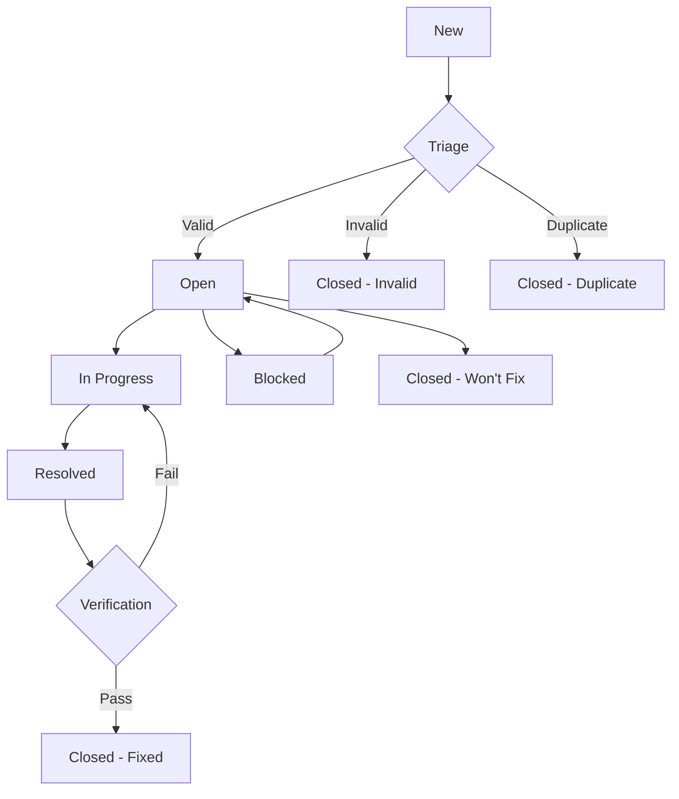
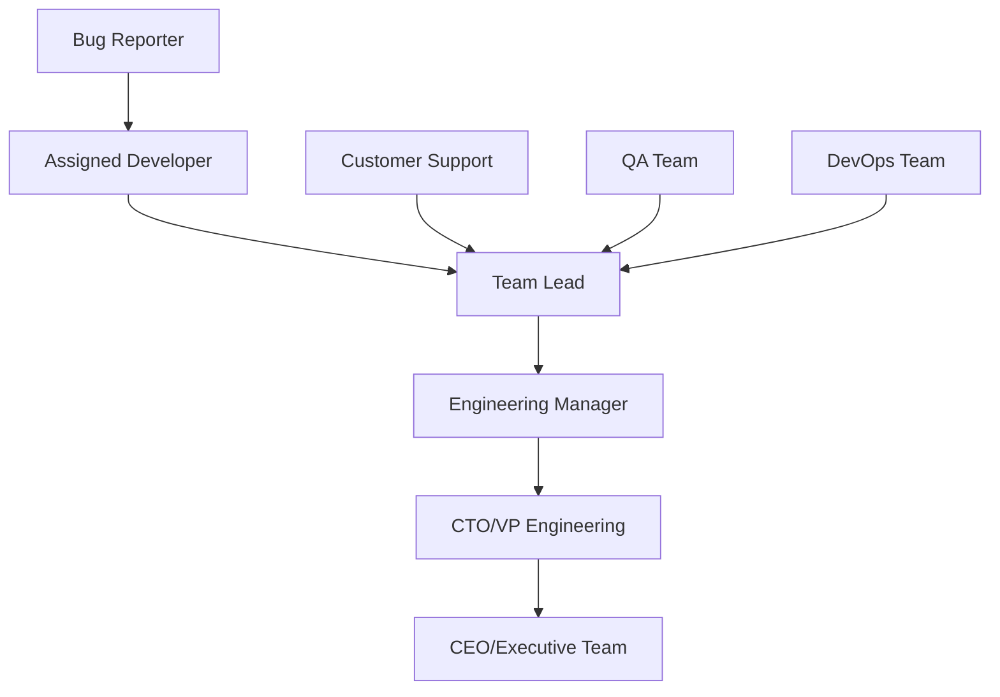

# Bug Management Workflow and Templates

## Table of Contents
1. [Bug Management Overview](#bug-management-overview)
2. [Bug Classification System](#bug-classification-system)
3. [Bug Report Templates](#bug-report-templates)
4. [Bug Lifecycle Management](#bug-lifecycle-management)
5. [Triage Process](#triage-process)
6. [Assignment and Ownership](#assignment-and-ownership)
7. [Resolution Process](#resolution-process)
8. [Verification and Testing](#verification-and-testing)
9. [Communication Guidelines](#communication-guidelines)
10. [Escalation Procedures](#escalation-procedures)
11. [Metrics and Reporting](#metrics-and-reporting)
12. [Tools and Automation](#tools-and-automation)

## Bug Management Overview

### Objectives
- 🎯 **Rapid Response**: Ensure critical issues are addressed within SLA
- 🔍 **Root Cause Analysis**: Identify and eliminate underlying causes
- 📊 **Quality Metrics**: Track and improve overall product quality
- 🚀 **Process Efficiency**: Streamline bug resolution workflow
- 👥 **Team Coordination**: Enable effective collaboration on issue resolution

### Core Principles
1. **Customer Impact First**: Prioritize based on user impact
2. **Transparency**: Keep all stakeholders informed of progress
3. **Continuous Improvement**: Learn from each bug to prevent recurrence
4. **Data-Driven Decisions**: Use metrics to guide process improvements
5. **Proactive Prevention**: Focus on preventing bugs, not just fixing them

## Bug Classification System

### 🚨 Severity Levels

#### Critical (P0)
- **Definition**: System is completely unusable or causes data loss/corruption
- **Response Time**: 1 hour
- **Resolution Target**: 4 hours
- **Escalation**: Immediate notification to management
- **Examples**:
  - Tournament bot completely offline
  - Database corruption causing data loss
  - Security breach or vulnerability exploitation
  - Payment system failures (if applicable)

#### High (P1)
- **Definition**: Major functionality is broken, affecting core features
- **Response Time**: 4 hours
- **Resolution Target**: 24 hours
- **Escalation**: Team lead notification within 2 hours
- **Examples**:
  - Players cannot join tournaments
  - Game results not being recorded
  - Telegram commands not responding
  - Authentication system failures

#### Medium (P2)
- **Definition**: Minor functionality impacted, workarounds available
- **Response Time**: 24 hours
- **Resolution Target**: 1 week
- **Escalation**: Standard triage process
- **Examples**:
  - Incorrect statistics calculations
  - Minor UI formatting issues
  - Non-critical feature malfunctions
  - Performance degradation (non-critical)

#### Low (P3)
- **Definition**: Cosmetic issues or minor inconveniences
- **Response Time**: 1 week
- **Resolution Target**: Next minor release
- **Escalation**: Regular backlog management
- **Examples**:
  - Spelling errors in messages
  - Minor UI inconsistencies
  - Enhancement requests
  - Documentation updates

### 🎯 Impact Assessment Matrix

| Impact | High User Volume | Medium User Volume | Low User Volume |
|--------|------------------|-------------------|-----------------|
| **Data Loss** | Critical (P0) | Critical (P0) | High (P1) |
| **Feature Broken** | High (P1) | High (P1) | Medium (P2) |
| **Degraded Performance** | High (P1) | Medium (P2) | Low (P3) |
| **Cosmetic Issue** | Medium (P2) | Low (P3) | Low (P3) |

### 📂 Bug Categories

#### Functional Bugs
- Game logic errors
- Tournament management issues
- User interface malfunctions
- Integration failures

#### Performance Bugs
- Slow response times
- Memory leaks
- Database query inefficiencies
- Scalability issues

#### Security Bugs
- Authentication bypasses
- Data exposure vulnerabilities
- Input validation failures
- Privilege escalation

#### Usability Bugs
- Confusing user interfaces
- Accessibility issues
- Poor error messages
- Workflow inefficiencies

## Bug Report Templates

### 🐛 Standard Bug Report Template

```markdown
---
name: Bug Report
about: Report a bug in the RPS Tournament Bot
title: '[BUG] Brief description of the issue'
labels: 'bug, needs-triage'
assignees: ''
---

## Bug Information
**Bug ID**: [Auto-generated]
**Reporter**: [GitHub username]
**Date Reported**: [Auto-filled]
**Severity**: [Critical/High/Medium/Low]
**Component**: [Tournament/Game/Telegram/Database/API]
**Environment**: [Production/Staging/Development]

## Summary
[Provide a clear and concise description of the bug]

## Steps to Reproduce
1. [First step]
2. [Second step]
3. [Third step]
4. [Additional steps...]

## Expected Behavior
[Describe what you expected to happen]

## Actual Behavior
[Describe what actually happened]

## Impact Assessment
- **Users Affected**: [Number or percentage of users]
- **Business Impact**: [High/Medium/Low]
- **Frequency**: [Always/Often/Sometimes/Rarely]
- **Workaround Available**: [Yes/No - describe if yes]

## Environment Details
- **Bot Version**: [Version number]
- **Node.js Version**: [Version]
- **Database Version**: [PostgreSQL version]
- **Browser** (if applicable): [Browser and version]
- **Operating System**: [OS and version]

## Additional Information
### Error Messages
```
[Include any error messages or stack traces]
```

### Screenshots/Videos
[Attach screenshots or videos demonstrating the issue]

### User Information
- **User ID**: [If applicable and privacy-compliant]
- **Tournament ID**: [If applicable]
- **Match ID**: [If applicable]

### Logs
```
[Include relevant log entries - ensure no sensitive data]
```

## Technical Details
### Database State
[Any relevant database information]

### API Responses
[Include API response data if relevant]

### Network Information
[Include network-related details if applicable]

## Reporter Verification
- [ ] I have searched for similar issues
- [ ] I have provided all requested information
- [ ] I have tested in the latest version (if possible)
- [ ] I have removed any sensitive information
```

### 🚨 Critical Bug Report Template

```markdown
---
name: Critical Bug Report
about: Report a critical system failure
title: '[CRITICAL] System failure description'
labels: 'bug, critical, p0'
assignees: '@team-lead'
---

## 🚨 CRITICAL ISSUE ALERT 🚨

**Immediate Impact**: [Describe immediate business/user impact]
**Affected Systems**: [List all affected systems]
**Start Time**: [When the issue began]
**Detection Method**: [How was this discovered]

## Quick Assessment
- [ ] System completely down
- [ ] Data integrity compromised
- [ ] Security breach suspected
- [ ] Major functionality broken
- [ ] Other: [Specify]

## Immediate Actions Taken
- [ ] Incident response team notified
- [ ] System monitoring reviewed
- [ ] Initial troubleshooting performed
- [ ] Workaround implemented
- [ ] Users notified (if applicable)

## Detailed Description
[Provide comprehensive description of the issue]

## System Status
- **Database**: [Status]
- **API**: [Status]
- **Telegram Bot**: [Status]
- **Message Queue**: [Status]
- **Cache**: [Status]

## Error Evidence
### System Logs
```
[Critical error logs]
```

### Monitoring Alerts
[List triggered alerts and thresholds]

### User Reports
[Summary of user-reported issues]

## Contact Information
**Reporter**: [Name and contact]
**On-Call Engineer**: [Name and contact]
**Incident Commander**: [If assigned]

---
**This is a CRITICAL issue. Please respond immediately.**
```

### 🔍 Feature Bug Report Template

```markdown
---
name: Feature Bug Report
about: Report a bug in a specific feature
title: '[FEATURE] Feature name - Bug description'
labels: 'bug, feature-specific'
---

## Feature Information
**Feature Name**: [Tournament Management/Game Engine/Statistics/etc.]
**Feature Version**: [Version when feature was released]
**User Story**: [Link to original user story if available]

## Bug Description
[Detailed description of how the feature is misbehaving]

## Expected Feature Behavior
[How should the feature work according to specifications]

## Current Feature Behavior
[How is the feature currently behaving]

## Test Cases
### Passing Test Cases
- [List test cases that still pass]

### Failing Test Cases
- [List test cases that are now failing]

### Edge Cases Tested
- [List edge cases that were tested]

## Feature Dependencies
- [List other features that might be affected]
- [External dependencies that might be involved]

## Regression Information
- **Last Known Working Version**: [Version]
- **First Version with Bug**: [Version]
- **Recent Changes**: [Link to recent commits affecting this feature]
```

## Bug Lifecycle Management

### 📋 Bug States



#### State Definitions

| State | Description | Actions Required |
|-------|-------------|------------------|
| **New** | Bug reported, awaiting triage | Triage within SLA |
| **Open** | Triaged and ready for assignment | Assign to developer |
| **In Progress** | Actively being worked on | Regular status updates |
| **Blocked** | Cannot proceed due to dependencies | Document blocking issue |
| **Resolved** | Fix implemented and deployed | QA verification needed |
| **Closed - Fixed** | Verified as resolved | Archive and analyze |
| **Closed - Invalid** | Not a valid bug | Document reason |
| **Closed - Duplicate** | Duplicate of existing bug | Link to original |
| **Closed - Won't Fix** | Decided not to fix | Document rationale |

### ⏱️ SLA Tracking

#### Response Times
```typescript
interface BugSLA {
  severity: 'Critical' | 'High' | 'Medium' | 'Low';
  responseTime: number; // hours
  resolutionTarget: number; // hours
  escalationThreshold: number; // hours
}

const bugSLAs: BugSLA[] = [
  { severity: 'Critical', responseTime: 1, resolutionTarget: 4, escalationThreshold: 2 },
  { severity: 'High', responseTime: 4, resolutionTarget: 24, escalationThreshold: 8 },
  { severity: 'Medium', responseTime: 24, resolutionTarget: 168, escalationThreshold: 48 },
  { severity: 'Low', responseTime: 168, resolutionTarget: 672, escalationThreshold: 336 }
];
```

## Triage Process

### 🔍 Daily Triage Meeting

#### Meeting Structure (30 minutes max)
1. **New Bugs Review** (10 minutes)
   - Review all new bugs since last meeting
   - Assign severity and priority
   - Identify owners

2. **High Priority Updates** (10 minutes)
   - Status updates on Critical/High severity bugs
   - Blockers and dependencies discussion
   - Resource allocation adjustments

3. **Process Improvements** (10 minutes)
   - Pattern analysis from recent bugs
   - Process improvement suggestions
   - Tool and automation updates

#### Triage Checklist
- [ ] **Completeness**: All required information provided
- [ ] **Reproducibility**: Steps to reproduce are clear and actionable
- [ ] **Severity Assessment**: Severity level correctly assigned
- [ ] **Impact Analysis**: Business and user impact properly evaluated
- [ ] **Categorization**: Bug properly categorized by component/feature
- [ ] **Assignment**: Appropriate owner identified and assigned
- [ ] **Dependencies**: Related issues and dependencies identified
- [ ] **Priority Ranking**: Priority set within severity level

### 🎯 Triage Decision Matrix

| Criteria | Weight | Scoring |
|----------|--------|---------|
| **User Impact** | 40% | High(3), Medium(2), Low(1) |
| **Frequency** | 25% | Always(3), Often(2), Rarely(1) |
| **Business Impact** | 20% | High(3), Medium(2), Low(1) |
| **Fix Complexity** | 15% | Easy(3), Medium(2), Hard(1) |

**Priority Score = (User Impact × 0.4) + (Frequency × 0.25) + (Business Impact × 0.2) + (Fix Complexity × 0.15)**

## Assignment and Ownership

### 👥 Assignment Strategy

#### Automatic Assignment Rules
```yaml
# .github/CODEOWNERS for automatic assignment
# Game Engine bugs
/src/game/ @game-team-lead @senior-developer

# Tournament Management bugs  
/src/tournament/ @tournament-expert @backend-developer

# Telegram Integration bugs
/src/telegram/ @telegram-specialist @integration-developer

# Database bugs
/src/database/ @database-admin @backend-lead

# Security bugs
**security** @security-team @team-lead
```

#### Manual Assignment Criteria
- **Domain Expertise**: Assign to developer most familiar with affected code
- **Workload Balance**: Consider current bug assignments and sprint commitments
- **Learning Opportunities**: Balance between efficiency and skill development
- **Availability**: Account for time zones and vacation schedules

### 🏷️ Bug Ownership Responsibilities

#### Primary Owner
- [ ] **Acknowledge Assignment**: Respond within SLA timeframe
- [ ] **Investigation**: Thoroughly investigate root cause
- [ ] **Communication**: Provide regular status updates
- [ ] **Resolution**: Implement fix and ensure proper testing
- [ ] **Documentation**: Update relevant documentation

#### Secondary Owner (Backup)
- [ ] **Knowledge Sharing**: Stay informed of investigation progress
- [ ] **Availability**: Ready to take over if primary owner unavailable
- [ ] **Review**: Participate in code review of fix
- [ ] **Testing**: Assist with verification testing

## Resolution Process

### 🔧 Fix Development Workflow

#### Development Standards
```typescript
// Bug fix commit message format
// fix(component): brief description of fix

// Examples:
// fix(tournament): prevent duplicate player registration
// fix(game): correct rock-paper-scissors winner determination
// fix(telegram): handle invalid command gracefully
```

#### Testing Requirements
- [ ] **Unit Tests**: Add/update unit tests covering the bug scenario
- [ ] **Integration Tests**: Verify fix works in integrated environment
- [ ] **Regression Tests**: Ensure fix doesn't break existing functionality
- [ ] **Manual Testing**: Perform manual testing following bug reproduction steps

#### Code Review Process
- [ ] **Peer Review**: At least one peer developer review required
- [ ] **Senior Review**: Senior developer review for high/critical bugs
- [ ] **Security Review**: Security team review for security-related bugs
- [ ] **Performance Review**: Performance impact assessment for performance bugs

### 📝 Fix Documentation

#### Required Documentation
```markdown
## Bug Fix Documentation

### Bug ID: [BUG-XXXX]
**Summary**: [Brief description]
**Root Cause**: [Detailed explanation of underlying cause]

### Solution Approach
[Explain the chosen solution and alternatives considered]

### Changes Made
- File: [filename] - [description of changes]
- File: [filename] - [description of changes]

### Testing Performed
- [ ] Unit tests added/updated
- [ ] Integration tests passed
- [ ] Manual testing completed
- [ ] Regression testing performed

### Deployment Notes
[Any special deployment considerations]

### Risk Assessment
**Risk Level**: Low/Medium/High
**Mitigation**: [Steps taken to minimize risk]

### Verification Steps
1. [Step to verify fix]
2. [Step to verify fix]
3. [Step to verify fix]
```

## Verification and Testing

### ✅ QA Verification Process

#### Pre-Verification Checklist
- [ ] **Environment Setup**: Bug reproduced in testing environment
- [ ] **Test Data**: Appropriate test data prepared
- [ ] **Test Cases**: Verification test cases documented
- [ ] **Rollback Plan**: Rollback procedure prepared if needed

#### Verification Steps
1. **Reproduce Original Bug**: Confirm bug exists in pre-fix version
2. **Apply Fix**: Deploy fix to testing environment
3. **Verify Resolution**: Confirm bug no longer occurs
4. **Regression Testing**: Ensure no new issues introduced
5. **Performance Impact**: Measure any performance impact
6. **Edge Case Testing**: Test boundary conditions and edge cases

#### Verification Result Categories
- **✅ Verified Fixed**: Bug resolved, no regression detected
- **❌ Not Fixed**: Bug still occurs, return to development
- **⚠️ Partial Fix**: Bug partially resolved, additional work needed
- **🔄 Regression Detected**: Fix works but introduces new issues

### 🧪 Automated Verification

#### Automated Test Integration
```typescript
// Example automated verification test
describe('Bug Verification: Tournament Registration', () => {
  it('should prevent duplicate player registration (BUG-001)', async () => {
    // Arrange
    const tournament = await createTestTournament();
    const player = await createTestPlayer();
    
    // Act - First registration should succeed
    const firstRegistration = await tournamentService.registerPlayer(
      tournament.id, 
      player.id
    );
    
    // Assert first registration
    expect(firstRegistration.success).toBe(true);
    
    // Act - Second registration should fail
    const secondRegistration = await tournamentService.registerPlayer(
      tournament.id, 
      player.id
    );
    
    // Assert duplicate prevention
    expect(secondRegistration.success).toBe(false);
    expect(secondRegistration.error).toContain('already registered');
  });
});
```

## Communication Guidelines

### 📢 Stakeholder Communication

#### Communication Matrix
| Severity | Internal Team | Management | Users | Frequency |
|----------|---------------|------------|-------|-----------|
| **Critical** | Immediate | Immediate | ASAP | Real-time |
| **High** | 4 hours | 8 hours | Daily | Daily |
| **Medium** | Daily | Weekly | Weekly | Weekly |
| **Low** | Weekly | Monthly | Release notes | Monthly |

#### Communication Templates

##### Critical Bug Communication
```markdown
Subject: [CRITICAL] Production Issue - Tournament Bot Down

Team,

A critical issue has been identified affecting the tournament bot:

**Issue**: Tournament bot is completely unresponsive
**Impact**: All users unable to participate in tournaments
**Started**: 2025-07-26 14:30 UTC
**ETA**: Investigating - updates every 30 minutes

**Immediate Actions**:
- Incident response team activated
- Engineering team investigating
- Monitoring systems reviewed

**Next Update**: 15:00 UTC

- [Your Name], Incident Commander
```

##### Bug Resolution Communication
```markdown
Subject: [RESOLVED] Bug Fix Deployed - Tournament Registration

Team,

The tournament registration bug has been resolved:

**Bug**: Players could register multiple times for same tournament
**Fix**: Added duplicate registration prevention
**Deployed**: 2025-07-26 16:45 UTC
**Verification**: Completed successfully

**Impact**:
- No user action required
- Historical data integrity maintained
- Monitoring shows normal operation resumed

**Prevention**:
- Added automated test coverage
- Improved input validation
- Enhanced monitoring alerts

- [Your Name], QA Manager
```

## Escalation Procedures

### 🚨 Escalation Triggers

#### Automatic Escalation
- SLA response time exceeded
- Critical bug unresolved within 2 hours
- Security incident detected
- Data loss/corruption identified

#### Manual Escalation Criteria
- Complex bugs requiring additional expertise
- Cross-team coordination needed
- Resource conflicts preventing resolution
- Customer escalation received

### 📞 Escalation Path



#### Escalation Contacts
| Level | Role | Response Time | Contact Method |
|-------|------|---------------|----------------|
| L1 | Assigned Developer | Immediate | Slack/Email |
| L2 | Team Lead | 30 minutes | Phone/Slack |
| L3 | Engineering Manager | 1 hour | Phone |
| L4 | CTO/VP Engineering | 2 hours | Phone |
| L5 | Executive Team | 4 hours | Phone |

## Metrics and Reporting

### 📊 Key Performance Indicators

#### Bug Resolution Metrics
```typescript
interface BugMetrics {
  // Volume Metrics
  totalBugsReported: number;
  totalBugsResolved: number;
  backlogSize: number;
  
  // Time Metrics
  averageResolutionTime: number;
  averageResponseTime: number;
  slaComplianceRate: number;
  
  // Quality Metrics
  defectEscapeRate: number;
  regressionRate: number;
  customerReportedBugs: number;
  
  // Trend Metrics
  bugsReportedTrend: number[];
  resolutionTrend: number[];
  severityDistribution: Record<string, number>;
}
```

#### Quality Metrics Dashboard
- **Bug Discovery Rate**: Bugs found per week/month
- **Resolution Velocity**: Bugs resolved per sprint/week
- **Customer Satisfaction**: Bug resolution satisfaction scores
- **Prevention Effectiveness**: Reduction in similar bug types
- **Team Productivity**: Developer time spent on bugs vs features

### 📈 Reporting Schedule

#### Daily Reports
- Critical/High severity bug status
- SLA compliance alerts
- Escalation notifications
- Resource allocation updates

#### Weekly Reports  
- Bug resolution summary
- Trend analysis
- Quality metrics review
- Process improvement suggestions

#### Monthly Reports
- Comprehensive bug analysis
- Quality trend assessment
- Process effectiveness review
- Strategic improvement recommendations

### 📋 Report Templates

#### Weekly Bug Summary Report
```markdown
# Weekly Bug Report - Week of [Date]

## Executive Summary
- **Total Bugs Reported**: [Number]
- **Total Bugs Resolved**: [Number]
- **SLA Compliance**: [Percentage]
- **Critical Issues**: [Number and status]

## Key Metrics
| Metric | This Week | Last Week | Trend |
|--------|-----------|-----------|-------|
| New Bugs | [Number] | [Number] | [↑↓→] |
| Resolved Bugs | [Number] | [Number] | [↑↓→] |
| Backlog Size | [Number] | [Number] | [↑↓→] |
| Avg Resolution Time | [Hours] | [Hours] | [↑↓→] |

## Severity Breakdown
- **Critical (P0)**: [Number] - [List if any]
- **High (P1)**: [Number] - [Status summary]
- **Medium (P2)**: [Number] - [Key issues]
- **Low (P3)**: [Number] - [Planned resolution]

## Top Issues This Week
1. [Issue description and status]
2. [Issue description and status]
3. [Issue description and status]

## Process Improvements
- [Improvement made this week]
- [Process change implemented]
- [Tool enhancement deployed]

## Next Week Focus
- [Priority areas for next week]
- [Process improvements planned]
- [Resource allocation changes]

Prepared by: [QA Manager]
Date: [Report Date]
```

## Tools and Automation

### 🛠️ Bug Tracking Tools

#### GitHub Issues Configuration
```yaml
# .github/ISSUE_TEMPLATE/config.yml
blank_issues_enabled: false
contact_links:
  - name: Security Issues
    url: mailto:security@company.com
    about: Please report security vulnerabilities via email

# Bug report template
name: Bug Report
description: File a bug report
title: "[Bug]: "
labels: ["bug", "needs-triage"]
body:
  - type: markdown
    attributes:
      value: |
        Thanks for taking the time to fill out this bug report!
        
  - type: dropdown
    attributes:
      label: Severity
      description: How severe is this bug?
      options:
        - Critical (P0) - System down/data loss
        - High (P1) - Major functionality broken
        - Medium (P2) - Minor functionality impacted
        - Low (P3) - Cosmetic issues
    validations:
      required: true
```

#### Automation Scripts
```typescript
// Bug auto-assignment based on component
export class BugAutoAssignment {
  private assignmentRules = {
    'tournament': ['@tournament-expert', '@backend-lead'],
    'game': ['@game-developer', '@algorithm-expert'],
    'telegram': ['@telegram-specialist', '@integration-dev'],
    'database': ['@db-admin', '@backend-lead'],
    'security': ['@security-team', '@team-lead']
  };

  assignBug(bug: Bug): string[] {
    const component = this.detectComponent(bug);
    return this.assignmentRules[component] || ['@team-lead'];
  }

  private detectComponent(bug: Bug): string {
    const keywords = {
      tournament: ['tournament', 'bracket', 'registration', 'match'],
      game: ['game', 'rock', 'paper', 'scissors', 'winner'],
      telegram: ['telegram', 'bot', 'command', 'message'],
      database: ['database', 'query', 'connection', 'data'],
      security: ['security', 'auth', 'token', 'vulnerability']
    };

    for (const [component, keywordList] of Object.entries(keywords)) {
      if (keywordList.some(keyword => 
        bug.title.toLowerCase().includes(keyword) ||
        bug.description.toLowerCase().includes(keyword)
      )) {
        return component;
      }
    }

    return 'general';
  }
}
```

### 📊 Monitoring and Alerting

#### Bug SLA Monitoring
```typescript
export class BugSLAMonitor {
  async checkSLAViolations(): Promise<BugSLAViolation[]> {
    const activeBugs = await this.bugRepository.findActiveBugs();
    const violations: BugSLAViolation[] = [];

    for (const bug of activeBugs) {
      const sla = this.getSLAForSeverity(bug.severity);
      const elapsedTime = this.getElapsedTime(bug.createdAt);

      if (elapsedTime > sla.responseTime && !bug.firstResponseAt) {
        violations.push({
          bugId: bug.id,
          type: 'response',
          elapsedTime,
          slaTime: sla.responseTime,
          escalationNeeded: elapsedTime > sla.escalationThreshold
        });
      }

      if (elapsedTime > sla.resolutionTarget && bug.status !== 'resolved') {
        violations.push({
          bugId: bug.id,
          type: 'resolution',
          elapsedTime,
          slaTime: sla.resolutionTarget,
          escalationNeeded: true
        });
      }
    }

    return violations;
  }
}
```

### 🔄 Integration with Development Workflow

#### Git Hooks for Bug Tracking
```bash
#!/bin/bash
# pre-commit hook to validate bug references

commit_msg=$(cat $1)

# Check if commit references a bug
if [[ $commit_msg =~ ^fix\(.*\): ]]; then
  # Extract bug ID from commit message
  bug_id=$(echo "$commit_msg" | grep -o 'BUG-[0-9]\+' | head -1)
  
  if [ -z "$bug_id" ]; then
    echo "Error: Bug fix commits must reference a bug ID (e.g., 'fixes BUG-123')"
    exit 1
  fi
  
  # Validate bug exists and is assigned to committer
  if ! ./scripts/validate-bug-assignment.sh "$bug_id" "$GIT_COMMITTER_EMAIL"; then
    echo "Error: Bug $bug_id is not assigned to $GIT_COMMITTER_EMAIL"
    exit 1
  fi
fi
```

---

**Document Version**: 1.0  
**Last Updated**: 2025-07-26  
**Next Review Date**: 2025-10-26  
**Owner**: QA Manager  
**Stakeholders**: Development Team, Product Manager, Support Team