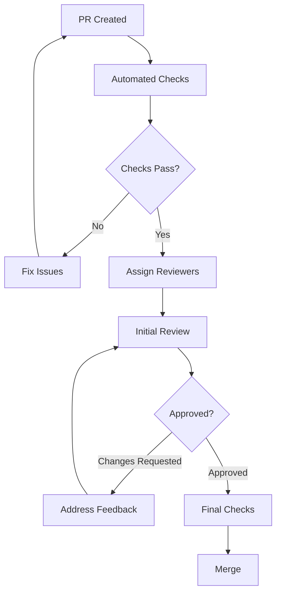

# Code Review Guidelines and Checklists

## Table of Contents
1. [Review Philosophy](#review-philosophy)
2. [Review Process](#review-process)
3. [Code Quality Checklist](#code-quality-checklist)
4. [Testing Review Checklist](#testing-review-checklist)
5. [Security Review Checklist](#security-review-checklist)
6. [Performance Review Checklist](#performance-review-checklist)
7. [Architecture Review Guidelines](#architecture-review-guidelines)
8. [Review Templates](#review-templates)
9. [Common Issues and Solutions](#common-issues-and-solutions)
10. [Tools and Automation](#tools-and-automation)

## Review Philosophy

### Core Principles
1. **Constructive Feedback**: Reviews should help improve code quality and knowledge sharing
2. **Collaborative Learning**: Every review is a learning opportunity for both author and reviewer
3. **Quality over Speed**: Thorough reviews prevent technical debt and production issues
4. **Consistency**: Maintain coding standards and architectural patterns
5. **Security First**: Always consider security implications of changes

### Review Goals
- ✅ Ensure code quality and maintainability
- ✅ Verify functionality meets requirements
- ✅ Identify potential bugs and edge cases
- ✅ Maintain architectural consistency
- ✅ Share knowledge across the team
- ✅ Ensure proper testing coverage

## Review Process

### 1. Pre-Review Preparation (Author)

#### Before Submitting PR
- [ ] **Self-Review**: Review your own code thoroughly
- [ ] **Testing**: Ensure all tests pass locally
- [ ] **Documentation**: Update relevant documentation
- [ ] **Commit Messages**: Use clear, descriptive commit messages
- [ ] **PR Description**: Provide comprehensive description of changes

#### PR Description Template
```markdown
## Summary
Brief description of changes and motivation

## Type of Change
- [ ] Bug fix
- [ ] New feature
- [ ] Breaking change
- [ ] Documentation update
- [ ] Refactoring
- [ ] Performance improvement

## Testing
- [ ] Unit tests added/updated
- [ ] Integration tests added/updated
- [ ] E2E tests added/updated
- [ ] Manual testing completed

## Checklist
- [ ] Code follows style guidelines
- [ ] Self-review completed
- [ ] Documentation updated
- [ ] Tests added for new functionality
- [ ] All tests pass

## Screenshots/Videos
[If applicable, add screenshots or videos demonstrating the changes]

## Related Issues
Closes #[issue number]
```

### 2. Review Assignment

#### Reviewer Selection Criteria
- **Domain Expertise**: Choose reviewers familiar with the affected codebase area
- **Security Critical**: Include security-focused reviewer for auth/data handling changes
- **Architecture Changes**: Include senior developer or architect
- **Database Changes**: Include database specialist
- **Performance Critical**: Include performance specialist

#### Review Distribution
- **Minimum**: 2 reviewers per PR
- **Complex Changes**: 3+ reviewers
- **Critical Systems**: Lead developer + domain expert
- **Breaking Changes**: Architecture review required

### 3. Review Process Workflow



## Code Quality Checklist

### 🔍 General Code Quality

#### Structure and Organization
- [ ] **Single Responsibility**: Each function/class has a single, well-defined purpose
- [ ] **Naming**: Variables, functions, and classes have descriptive, intention-revealing names
- [ ] **Function Size**: Functions are reasonably sized (generally <50 lines)
- [ ] **File Organization**: Related functionality is properly grouped
- [ ] **Import Organization**: Imports are organized and unused imports removed

#### Code Style and Formatting
- [ ] **Consistent Formatting**: Code follows established formatting standards
- [ ] **ESLint Compliance**: No linting errors or warnings
- [ ] **TypeScript Strict**: Proper TypeScript types used throughout
- [ ] **Comments**: Complex logic is well-commented
- [ ] **Dead Code**: No commented-out or unused code

#### Error Handling
- [ ] **Comprehensive Error Handling**: All error scenarios are handled appropriately
- [ ] **Error Messages**: Error messages are descriptive and actionable
- [ ] **Logging**: Appropriate logging levels used (error, warn, info, debug)
- [ ] **Graceful Degradation**: System handles failures gracefully
- [ ] **Resource Cleanup**: Proper cleanup of resources and connections

### 🎯 NestJS Specific Checks

#### Module Structure
- [ ] **Module Organization**: Features properly organized into modules
- [ ] **Dependency Injection**: Proper use of NestJS DI container
- [ ] **Provider Configuration**: Services, repositories, and utilities properly configured
- [ ] **Export Strategy**: Only necessary components are exported

#### Service Implementation
- [ ] **Service Layer Logic**: Business logic properly encapsulated in services
- [ ] **Repository Pattern**: Data access properly abstracted through repositories
- [ ] **Transaction Management**: Database transactions used where appropriate
- [ ] **Async/Await**: Proper async/await usage for asynchronous operations

#### Controller Implementation
- [ ] **Route Organization**: REST endpoints follow RESTful conventions
- [ ] **Input Validation**: DTOs used for request validation
- [ ] **Response Format**: Consistent response format across endpoints
- [ ] **HTTP Status Codes**: Appropriate HTTP status codes used

### 🎮 Game Logic Specific Checks

#### Tournament Management
- [ ] **Bracket Generation**: Tournament brackets generated correctly
- [ ] **Player Registration**: Registration logic handles edge cases
- [ ] **Match Scheduling**: Matches scheduled and progressed correctly
- [ ] **Concurrency**: Concurrent operations handled safely

#### Game Engine
- [ ] **RPS Logic**: Rock-Paper-Scissors rules implemented correctly
- [ ] **State Management**: Game state transitions handled properly
- [ ] **Timeout Handling**: Game timeouts managed appropriately
- [ ] **Result Calculation**: Win/loss/draw calculations are accurate

#### Telegram Integration
- [ ] **Command Handling**: Bot commands processed correctly
- [ ] **Message Formatting**: Messages formatted properly for Telegram
- [ ] **Callback Handling**: Inline keyboard callbacks handled correctly
- [ ] **Error Responses**: Error conditions communicated clearly to users

## Testing Review Checklist

### 🧪 Test Coverage and Quality

#### Unit Tests
- [ ] **Coverage**: New code has adequate unit test coverage (≥85%)
- [ ] **Test Cases**: All logical branches and edge cases tested
- [ ] **Mock Strategy**: Appropriate mocking of dependencies
- [ ] **Test Isolation**: Tests are independent and can run in any order
- [ ] **Test Naming**: Test names clearly describe what is being tested

#### Integration Tests
- [ ] **Service Integration**: Multi-service interactions tested
- [ ] **Database Integration**: Database operations tested with real connections
- [ ] **API Integration**: HTTP endpoints tested end-to-end
- [ ] **Message Queue**: Async message processing tested

#### Test Quality
- [ ] **AAA Pattern**: Tests follow Arrange-Act-Assert pattern
- [ ] **Descriptive Assertions**: Assertions clearly indicate expected behavior
- [ ] **Test Data**: Appropriate test data setup and cleanup
- [ ] **Performance**: Tests execute within reasonable time limits
- [ ] **Flakiness**: Tests are deterministic and not flaky

### 🔧 Test Implementation

#### Mock Strategy
```typescript
// ✅ Good: Proper mocking with clear expectations
const mockTournamentService = {
  createTournament: jest.fn().mockResolvedValue(mockTournament),
  registerPlayer: jest.fn().mockResolvedValue({ success: true }),
};

// ❌ Bad: Over-mocking without clear purpose
const mockEverything = jest.fn().mockReturnValue(true);
```

#### Test Structure
```typescript
// ✅ Good: Clear test structure
describe('GameService', () => {
  describe('determineWinner', () => {
    it('should return PLAYER1_WIN when rock beats scissors', () => {
      // Arrange
      const player1Move = GameMove.ROCK;
      const player2Move = GameMove.SCISSORS;
      
      // Act
      const result = service.determineWinner(player1Move, player2Move);
      
      // Assert
      expect(result).toBe(GameResult.PLAYER1_WIN);
    });
  });
});
```

## Security Review Checklist

### 🛡️ Authentication and Authorization

#### Telegram Integration Security
- [ ] **Webhook Validation**: Telegram webhook signatures properly validated
- [ ] **User Authentication**: Telegram user data properly verified
- [ ] **Rate Limiting**: API endpoints protected against abuse
- [ ] **Session Management**: User sessions handled securely

#### Access Control
- [ ] **Admin Privileges**: Admin functionality properly protected
- [ ] **Tournament Access**: Users can only access authorized tournaments
- [ ] **Data Isolation**: User data properly isolated and protected
- [ ] **Resource Authorization**: Users can only modify resources they own

### 🔐 Input Validation and Sanitization

#### Data Validation
- [ ] **Input Validation**: All user inputs validated and sanitized
- [ ] **SQL Injection**: Parameterized queries used throughout
- [ ] **Command Injection**: No direct command execution with user input
- [ ] **XSS Prevention**: User-generated content properly escaped

#### Data Types
```typescript
// ✅ Good: Proper input validation with DTOs
export class CreateTournamentDto {
  @IsString()
  @Length(3, 50)
  name: string;

  @IsInt()
  @Min(2)
  @Max(64)
  maxPlayers: number;
}

// ❌ Bad: No validation
function createTournament(data: any) {
  // Direct use of unvalidated data
}
```

### 🔒 Data Protection

#### Sensitive Data Handling
- [ ] **PII Protection**: Personal information properly protected
- [ ] **Data Encryption**: Sensitive data encrypted at rest
- [ ] **Secure Transmission**: HTTPS used for all communications
- [ ] **Password Security**: No plaintext passwords or tokens

#### Logging Security
- [ ] **Log Sanitization**: Sensitive data not logged
- [ ] **Log Access**: Log access properly restricted
- [ ] **Audit Trail**: Important actions properly audited
- [ ] **Error Information**: Error messages don't leak sensitive information

## Performance Review Checklist

### ⚡ Database Performance

#### Query Optimization
- [ ] **Query Efficiency**: Database queries optimized for performance
- [ ] **Index Usage**: Proper database indexes in place
- [ ] **N+1 Prevention**: N+1 query problems avoided
- [ ] **Connection Pooling**: Database connections properly pooled

#### Data Access Patterns
```typescript
// ✅ Good: Efficient data loading with relations
const tournament = await this.tournamentRepository.findOne({
  where: { id },
  relations: ['players', 'matches'],
});

// ❌ Bad: Multiple separate queries
const tournament = await this.tournamentRepository.findOne({ where: { id } });
const players = await this.playerRepository.find({ where: { tournamentId: id } });
```

### 🚀 Application Performance

#### Memory Management
- [ ] **Memory Leaks**: No obvious memory leaks in long-running operations
- [ ] **Resource Cleanup**: Proper cleanup of resources and connections
- [ ] **Caching Strategy**: Appropriate caching implemented where beneficial
- [ ] **Garbage Collection**: Code written to minimize GC pressure

#### Concurrency and Scaling
- [ ] **Race Conditions**: Concurrent operations handled safely
- [ ] **Deadlock Prevention**: Database operations designed to prevent deadlocks
- [ ] **Load Handling**: Code can handle expected load levels
- [ ] **Scalability**: Design supports horizontal scaling

## Architecture Review Guidelines

### 🏗️ Architectural Consistency

#### Design Patterns
- [ ] **Pattern Adherence**: Code follows established architectural patterns
- [ ] **Separation of Concerns**: Clear separation between layers
- [ ] **Dependency Direction**: Dependencies follow proper direction
- [ ] **Interface Contracts**: Well-defined interfaces between components

#### Module Design
- [ ] **Module Cohesion**: Related functionality properly grouped
- [ ] **Module Coupling**: Loose coupling between modules
- [ ] **API Design**: Clean, intuitive APIs
- [ ] **Extensibility**: Design allows for future extensions

### 🔄 Event-Driven Architecture

#### Message Handling
- [ ] **Event Design**: Events properly designed and documented
- [ ] **Message Durability**: Critical messages handled durably
- [ ] **Error Handling**: Message processing errors handled appropriately
- [ ] **Idempotency**: Message handlers are idempotent where needed

## Review Templates

### 📝 Standard Review Comment Templates

#### Requesting Changes
```markdown
**Issue**: [Brief description of the problem]

**Impact**: [Explanation of why this matters]

**Suggestion**: [Specific recommendation for improvement]

**Example**: 
```typescript
// Current implementation
// Suggested improvement
```

**Priority**: High/Medium/Low
```

#### Approving with Minor Comments
```markdown
**Overall**: Great work! The implementation looks solid and follows our patterns well.

**Minor Suggestions**:
- Consider extracting this magic number to a constant
- The error message could be more descriptive
- Small typo in the comment on line X

**Status**: Approved - feel free to address these in a follow-up if needed.
```

#### Architecture Feedback
```markdown
**Architecture Review**:

**Strengths**:
- Clean separation of concerns
- Proper use of dependency injection
- Good error handling strategy

**Concerns**:
- Potential performance issue with query in TournamentService.getAll()
- Consider using a factory pattern for GameEngine creation
- Transaction boundary might be too broad in createTournamentWithPlayers()

**Recommendations**:
1. Add database index for frequently queried fields
2. Extract game creation logic to separate service
3. Split transaction into smaller, focused operations

**Status**: Changes requested for performance and maintainability
```

## Common Issues and Solutions

### 🐛 Frequent Review Issues

#### Testing Issues
| Issue | Solution |
|-------|----------|
| Insufficient test coverage | Add unit tests for all new functionality |
| Tests depend on external services | Use mocks/stubs for external dependencies |
| Flaky tests due to timing | Use proper async/await patterns and timeouts |
| Test data pollution | Ensure proper test cleanup and isolation |

#### Code Quality Issues
| Issue | Solution |
|-------|----------|
| Magic numbers/strings | Extract to named constants |
| Overly complex functions | Break down into smaller, focused functions |
| Inconsistent error handling | Implement standardized error handling pattern |
| Missing input validation | Add DTO validation for all inputs |

#### Performance Issues
| Issue | Solution |
|-------|----------|
| N+1 query problems | Use eager loading or batch queries |
| Memory leaks | Implement proper resource cleanup |
| Blocking operations | Use async/await for I/O operations |
| Inefficient algorithms | Optimize algorithm complexity |

### 🔧 Quick Fixes

#### Code Style Fixes
```typescript
// ❌ Problematic
function processPlayers(players: any[]) {
  for (let i = 0; i < players.length; i++) {
    if (players[i].status == 'active') {
      // process player
    }
  }
}

// ✅ Improved
function processActivePlayers(players: Player[]): void {
  const activePlayers = players.filter(player => player.status === PlayerStatus.ACTIVE);
  
  for (const player of activePlayers) {
    this.processPlayer(player);
  }
}
```

## Tools and Automation

### 🛠️ Review Tools Integration

#### GitHub Integration
```yaml
# .github/pull_request_template.md
## Code Quality Checklist
- [ ] Code follows style guidelines
- [ ] All tests pass
- [ ] Coverage meets minimum requirements
- [ ] Documentation updated
- [ ] Security considerations addressed

## Review Assignment
- [ ] Domain expert assigned
- [ ] Security reviewer assigned (if applicable)
- [ ] Architecture review needed (if applicable)
```

#### Automated Checks
```yaml
# .github/workflows/pr-checks.yml
name: PR Quality Checks
on:
  pull_request:
    types: [opened, synchronize]

jobs:
  quality-gate:
    runs-on: ubuntu-latest
    steps:
      - name: Code Quality Check
        run: |
          npm run lint
          npm run typecheck
          npm run test:coverage
          npm run security:scan
```

### 📊 Review Metrics

#### Tracking Review Effectiveness
```typescript
interface ReviewMetrics {
  timeToFirstReview: number;
  timeToApproval: number;
  numberOfIterations: number;
  defectEscapeRate: number;
  reviewParticipation: number;
}

class ReviewAnalytics {
  trackReviewMetrics(pr: PullRequest): ReviewMetrics {
    return {
      timeToFirstReview: this.calculateTimeToFirstReview(pr),
      timeToApproval: this.calculateTimeToApproval(pr),
      numberOfIterations: pr.reviews.length,
      defectEscapeRate: this.calculateDefectEscapeRate(pr),
      reviewParticipation: this.calculateParticipation(pr)
    };
  }
}
```

### 🎯 Review Quality Metrics

#### KPIs to Track
- **Review Coverage**: Percentage of PRs that receive adequate review
- **Review Depth**: Average number of comments per PR
- **Time to Review**: Average time from PR creation to first review
- **Defect Detection**: Bugs caught in review vs. production
- **Review Participation**: Team member involvement in reviews

#### Improvement Targets
- **Review Time**: <4 hours for standard PRs, <24 hours for complex changes
- **Defect Detection**: >80% of bugs caught before production
- **Coverage**: 100% of PRs receive minimum required reviews
- **Participation**: All team members participate in reviews regularly

---

**Document Version**: 1.0  
**Last Updated**: 2025-07-26  
**Next Review Date**: 2025-10-26  
**Owner**: QA Manager  
**Reviewers**: Development Team