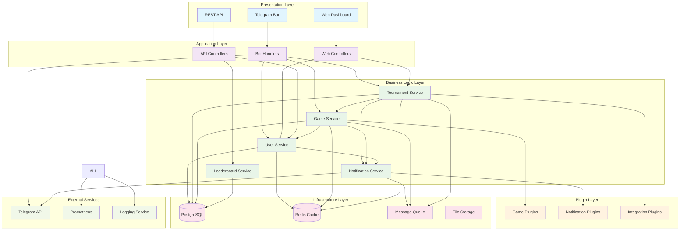

# Modular Architecture Design - Telegram RPS Tournament Bot

## 🏗️ **EXECUTIVE ARCHITECTURE SUMMARY**

This document defines a comprehensive modular architecture for the Telegram Rock-Paper-Scissors Tournament Bot, designed for maximum reusability, maintainability, and extensibility. The architecture follows NestJS best practices with a plugin-based approach for future game integrations.

---

## 📋 **TABLE OF CONTENTS**

1. [Project Structure](#project-structure)
2. [Core Module Architecture](#core-module-architecture)
3. [Component Interfaces](#component-interfaces)
4. [Documentation Standards](#documentation-standards)
5. [Reusability Framework](#reusability-framework)
6. [Plugin Architecture](#plugin-architecture)
7. [Testing Strategy](#testing-strategy)
8. [Deployment Architecture](#deployment-architecture)

---

## 🏗️ **PROJECT STRUCTURE**

### Complete Folder Structure

```
gamebot/
├── 📁 src/
│   ├── 📁 core/                           # Core framework modules
│   │   ├── 📁 interfaces/                 # Core interfaces and contracts
│   │   ├── 📁 decorators/                 # Custom decorators
│   │   ├── 📁 guards/                     # Authentication & authorization
│   │   ├── 📁 interceptors/               # Request/response interceptors
│   │   ├── 📁 pipes/                      # Validation pipes
│   │   └── 📁 filters/                    # Exception filters
│   │
│   ├── 📁 modules/                        # Business logic modules
│   │   ├── 📁 user/                       # User management
│   │   │   ├── 📁 entities/               # TypeORM entities
│   │   │   ├── 📁 dto/                    # Data transfer objects
│   │   │   ├── 📁 services/               # Business logic services
│   │   │   ├── 📁 controllers/            # HTTP/WebSocket controllers
│   │   │   ├── 📁 repositories/           # Data access layer
│   │   │   ├── 📁 interfaces/             # Module interfaces
│   │   │   └── user.module.ts             # Module definition
│   │   │
│   │   ├── 📁 game/                       # Game engine module
│   │   │   ├── 📁 engines/                # Game engines (RPS, future games)
│   │   │   │   ├── 📁 rps/                # Rock Paper Scissors engine
│   │   │   │   │   ├── rps-engine.service.ts
│   │   │   │   │   ├── rps-rules.service.ts
│   │   │   │   │   └── rps-state.service.ts
│   │   │   │   └── 📁 base/               # Base game engine
│   │   │   │       ├── base-game-engine.ts
│   │   │   │       └── game-engine.interface.ts
│   │   │   ├── 📁 entities/
│   │   │   ├── 📁 dto/
│   │   │   ├── 📁 services/
│   │   │   ├── 📁 controllers/
│   │   │   ├── 📁 processors/             # Queue processors
│   │   │   └── game.module.ts
│   │   │
│   │   ├── 📁 tournament/                 # Tournament management
│   │   │   ├── 📁 bracket-generators/     # Bracket generation algorithms
│   │   │   │   ├── single-elimination.generator.ts
│   │   │   │   ├── double-elimination.generator.ts
│   │   │   │   └── round-robin.generator.ts
│   │   │   ├── 📁 entities/
│   │   │   ├── 📁 dto/
│   │   │   ├── 📁 services/
│   │   │   ├── 📁 controllers/
│   │   │   └── tournament.module.ts
│   │   │
│   │   ├── 📁 bot/                        # Telegram bot integration
│   │   │   ├── 📁 handlers/               # Command & callback handlers
│   │   │   │   ├── 📁 commands/           # Command handlers
│   │   │   │   │   ├── game.commands.ts
│   │   │   │   │   ├── tournament.commands.ts
│   │   │   │   │   └── admin.commands.ts
│   │   │   │   ├── 📁 callbacks/          # Callback query handlers
│   │   │   │   └── 📁 middleware/         # Custom middleware
│   │   │   ├── 📁 keyboards/              # Inline keyboards
│   │   │   ├── 📁 services/
│   │   │   └── bot.module.ts
│   │   │
│   │   ├── 📁 notification/               # Notification system
│   │   │   ├── 📁 channels/               # Notification channels
│   │   │   │   ├── telegram.channel.ts
│   │   │   │   ├── websocket.channel.ts
│   │   │   │   └── email.channel.ts       # Future extension
│   │   │   ├── 📁 templates/              # Message templates
│   │   │   ├── 📁 services/
│   │   │   └── notification.module.ts
│   │   │
│   │   ├── 📁 leaderboard/                # Rankings and statistics
│   │   │   ├── 📁 entities/
│   │   │   ├── 📁 services/
│   │   │   ├── 📁 controllers/
│   │   │   └── leaderboard.module.ts
│   │   │
│   │   ├── 📁 analytics/                  # Performance analytics
│   │   │   ├── 📁 collectors/             # Data collectors
│   │   │   ├── 📁 processors/             # Analytics processors
│   │   │   ├── 📁 services/
│   │   │   └── analytics.module.ts
│   │   │
│   │   └── 📁 admin/                      # Administrative controls
│   │       ├── 📁 dashboard/              # Web dashboard
│   │       ├── 📁 services/
│   │       ├── 📁 controllers/
│   │       └── admin.module.ts
│   │
│   ├── 📁 shared/                         # Shared utilities and services
│   │   ├── 📁 database/                   # Database configuration
│   │   │   ├── 📁 migrations/             # Database migrations
│   │   │   ├── 📁 seeds/                  # Database seeds
│   │   │   ├── database.module.ts
│   │   │   └── database.service.ts
│   │   │
│   │   ├── 📁 cache/                      # Caching services
│   │   │   ├── redis.service.ts
│   │   │   ├── memory.service.ts
│   │   │   └── cache.module.ts
│   │   │
│   │   ├── 📁 queue/                      # Message queue services
│   │   │   ├── 📁 processors/             # Queue processors
│   │   │   ├── queue.service.ts
│   │   │   └── queue.module.ts
│   │   │
│   │   ├── 📁 logging/                    # Structured logging
│   │   │   ├── logger.service.ts
│   │   │   ├── log-formatter.ts
│   │   │   └── logging.module.ts
│   │   │
│   │   ├── 📁 utils/                      # Utility functions
│   │   │   ├── date.utils.ts
│   │   │   ├── crypto.utils.ts
│   │   │   ├── validation.utils.ts
│   │   │   └── ascii-art.utils.ts
│   │   │
│   │   ├── 📁 constants/                  # Application constants
│   │   │   ├── game.constants.ts
│   │   │   ├── tournament.constants.ts
│   │   │   └── system.constants.ts
│   │   │
│   │   └── 📁 types/                      # TypeScript type definitions
│   │       ├── game.types.ts
│   │       ├── tournament.types.ts
│   │       ├── user.types.ts
│   │       └── api.types.ts
│   │
│   ├── 📁 plugins/                        # Plugin system for extensibility
│   │   ├── 📁 games/                      # Game plugins
│   │   │   ├── 📁 rps/                    # Rock Paper Scissors plugin
│   │   │   └── 📁 template/               # Plugin template
│   │   │
│   │   ├── 📁 notifications/              # Notification plugins
│   │   └── 📁 integrations/               # Third-party integrations
│   │
│   ├── 📁 config/                         # Configuration management
│   │   ├── app.config.ts                  # Application configuration
│   │   ├── database.config.ts             # Database configuration
│   │   ├── redis.config.ts                # Redis configuration
│   │   ├── bot.config.ts                  # Bot configuration
│   │   └── environment.validation.ts      # Environment validation
│   │
│   ├── app.module.ts                      # Root application module
│   ├── main.ts                            # Application entry point
│   └── main.hmr.ts                        # Hot module replacement
│
├── 📁 test/                               # Testing infrastructure
│   ├── 📁 unit/                           # Unit tests
│   │   ├── 📁 modules/                    # Module unit tests
│   │   └── 📁 shared/                     # Shared utility tests
│   │
│   ├── 📁 integration/                    # Integration tests
│   │   ├── 📁 api/                        # API integration tests
│   │   ├── 📁 database/                   # Database integration tests
│   │   └── 📁 bot/                        # Bot integration tests
│   │
│   ├── 📁 e2e/                            # End-to-end tests
│   │   ├── 📁 tournament/                 # Tournament workflow tests
│   │   ├── 📁 game/                       # Game flow tests
│   │   └── 📁 admin/                      # Admin functionality tests
│   │
│   ├── 📁 performance/                    # Performance tests
│   │   ├── load-test.config.js            # Load testing configuration
│   │   └── stress-test.spec.ts            # Stress testing scenarios
│   │
│   ├── 📁 fixtures/                       # Test data fixtures
│   │   ├── users.fixture.ts
│   │   ├── tournaments.fixture.ts
│   │   └── games.fixture.ts
│   │
│   ├── 📁 mocks/                          # Mock implementations
│   │   ├── telegram.mock.ts
│   │   ├── database.mock.ts
│   │   └── redis.mock.ts
│   │
│   └── 📁 utils/                          # Testing utilities
│       ├── test-database.ts
│       ├── test-bot.ts
│       └── test-helpers.ts
│
├── 📁 docs/                               # Comprehensive documentation
│   ├── 📁 api/                            # API documentation
│   │   ├── openapi.json                   # OpenAPI specification
│   │   └── endpoints.md                   # Endpoint documentation
│   │
│   ├── 📁 architecture/                   # Architecture documentation
│   │   ├── module-dependencies.md         # Module dependency docs
│   │   ├── data-flow.md                   # Data flow diagrams
│   │   └── integration-patterns.md        # Integration patterns
│   │
│   ├── 📁 guides/                         # Development guides
│   │   ├── setup.md                       # Setup instructions
│   │   ├── contributing.md                # Contribution guidelines
│   │   ├── plugin-development.md          # Plugin development guide
│   │   └── troubleshooting.md             # Troubleshooting guide
│   │
│   ├── 📁 adr/                            # Architecture Decision Records
│   │   ├── 001-module-structure.md
│   │   ├── 002-database-choice.md
│   │   └── 003-plugin-architecture.md
│   │
│   └── 📁 examples/                       # Code examples
│       ├── plugin-example/
│       ├── custom-game-engine/
│       └── integration-example/
│
├── 📁 scripts/                            # Utility scripts
│   ├── 📁 database/                       # Database scripts
│   │   ├── migrate.ts
│   │   ├── seed.ts
│   │   └── backup.ts
│   │
│   ├── 📁 deployment/                     # Deployment scripts
│   │   ├── docker-build.sh
│   │   ├── k8s-deploy.sh
│   │   └── health-check.sh
│   │
│   └── 📁 development/                    # Development scripts
│       ├── generate-types.ts
│       ├── check-dependencies.ts
│       └── lint-fix.ts
│
├── 📁 docker/                             # Docker configuration
│   ├── Dockerfile
│   ├── docker-compose.yml
│   ├── docker-compose.dev.yml
│   └── docker-compose.test.yml
│
├── 📁 k8s/                                # Kubernetes manifests
│   ├── namespace.yaml
│   ├── deployment.yaml
│   ├── service.yaml
│   ├── configmap.yaml
│   └── secret.yaml
│
├── 📁 monitoring/                         # Monitoring configuration
│   ├── prometheus.yml
│   ├── grafana-dashboard.json
│   └── alerts.yml
│
├── 📄 Configuration Files
├── package.json                           # Dependencies and scripts
├── tsconfig.json                          # TypeScript configuration
├── jest.config.js                         # Test configuration
├── .eslintrc.js                           # Linting rules
├── .prettierrc                            # Code formatting
├── .gitignore                             # Git ignore rules
├── .env.example                           # Environment variables template
├── nest-cli.json                          # NestJS CLI configuration
├── docker-compose.yml                     # Development environment
└── README.md                              # Project documentation
```

---

## 🧩 **CORE MODULE ARCHITECTURE**

### 1. User Management Module

```typescript
// src/modules/user/user.module.ts
@Module({
  imports: [
    TypeOrmModule.forFeature([User, UserProfile, UserStats]),
    CacheModule,
    QueueModule.registerQueue({ name: 'user-events' })
  ],
  providers: [
    UserService,
    UserProfileService,
    UserStatsService,
    UserRepository,
    UserCacheService,
    UserEventProcessor,
    {
      provide: 'USER_CONFIG',
      useFactory: (configService: ConfigService) => configService.get('user'),
      inject: [ConfigService]
    }
  ],
  controllers: [UserController, UserStatsController],
  exports: [
    UserService,
    UserProfileService,
    UserStatsService,
    'USER_CONFIG'
  ]
})
export class UserModule implements OnModuleInit {
  constructor(
    private readonly userService: UserService,
    private readonly logger: Logger
  ) {}

  async onModuleInit() {
    this.logger.log('User module initialized');
    await this.userService.initializeDefaultUsers();
  }
}

// src/modules/user/interfaces/user-service.interface.ts
export interface IUserService {
  createUser(dto: CreateUserDto): Promise<User>;
  findById(id: string): Promise<User>;
  updateUser(id: string, dto: UpdateUserDto): Promise<User>;
  deleteUser(id: string): Promise<void>;
  findByTelegramId(telegramId: number): Promise<User>;
  getUserStats(userId: string): Promise<UserStats>;
  updateUserStats(userId: string, stats: Partial<UserStats>): Promise<UserStats>;
}

// src/modules/user/services/user.service.ts
@Injectable()
export class UserService implements IUserService {
  constructor(
    @InjectRepository(User)
    private readonly userRepository: Repository<User>,
    private readonly userCacheService: UserCacheService,
    private readonly eventEmitter: EventEmitter2,
    private readonly logger: Logger,
    @Inject('USER_CONFIG')
    private readonly config: UserConfig
  ) {}

  /**
   * Create a new user with comprehensive validation
   * @param dto - User creation data
   * @returns Created user entity
   */
  async createUser(dto: CreateUserDto): Promise<User> {
    this.logger.debug(`Creating user: ${dto.telegramId}`);
    
    try {
      // Validate user data
      await this.validateUserCreation(dto);
      
      // Create user entity
      const user = this.userRepository.create({
        ...dto,
        id: uuid(),
        createdAt: new Date(),
        isActive: true
      });
      
      // Save to database
      const savedUser = await this.userRepository.save(user);
      
      // Cache user data
      await this.userCacheService.setUser(savedUser.id, savedUser);
      
      // Emit user created event
      this.eventEmitter.emit('user.created', { user: savedUser });
      
      this.logger.log(`User created successfully: ${savedUser.id}`);
      return savedUser;
      
    } catch (error) {
      this.logger.error(`Failed to create user: ${error.message}`, error.stack);
      throw new UserCreationException(`Failed to create user: ${error.message}`);
    }
  }

  // ... additional methods
}
```

### 2. Game Engine Module

```typescript
// src/modules/game/game.module.ts
@Module({
  imports: [
    TypeOrmModule.forFeature([Game, GameSession, GameRound, GameHistory]),
    BullModule.registerQueue({ name: 'game-events' }),
    CacheModule,
    UserModule,
    NotificationModule
  ],
  providers: [
    GameService,
    GameEngineService,
    GameStateService,
    GameValidationService,
    RPSGameEngine,
    GameEventProcessor,
    GameCacheService,
    {
      provide: 'GAME_ENGINES',
      useFactory: (rpsEngine: RPSGameEngine) => new Map([
        ['rps', rpsEngine]
      ]),
      inject: [RPSGameEngine]
    }
  ],
  controllers: [GameController],
  exports: [
    GameService,
    GameEngineService,
    'GAME_ENGINES'
  ]
})
export class GameModule {}

// src/modules/game/interfaces/game-engine.interface.ts
export interface IGameEngine {
  readonly gameType: string;
  readonly maxPlayers: number;
  readonly minPlayers: number;
  
  initializeGame(players: Player[], options?: GameOptions): Promise<GameSession>;
  processMove(sessionId: string, playerId: string, move: GameMove): Promise<GameResult>;
  validateMove(move: GameMove): Promise<boolean>;
  determineWinner(moves: GameMove[]): Promise<GameOutcome>;
  isGameComplete(session: GameSession): Promise<boolean>;
  getGameState(sessionId: string): Promise<GameState>;
  cleanup(sessionId: string): Promise<void>;
}

// src/modules/game/engines/rps/rps-engine.service.ts
@Injectable()
export class RPSGameEngine implements IGameEngine {
  readonly gameType = 'rock-paper-scissors';
  readonly maxPlayers = 2;
  readonly minPlayers = 2;
  
  constructor(
    private readonly gameStateService: GameStateService,
    private readonly logger: Logger
  ) {}

  /**
   * Initialize a new RPS game session
   * @param players - Array of players (must be exactly 2)
   * @param options - Game configuration options
   * @returns Initialized game session
   */
  async initializeGame(players: Player[], options: RPSGameOptions = {}): Promise<GameSession> {
    if (players.length !== 2) {
      throw new InvalidPlayerCountException('RPS requires exactly 2 players');
    }

    const session: GameSession = {
      id: uuid(),
      gameType: this.gameType,
      players,
      rounds: [],
      currentRound: 1,
      maxRounds: options.bestOf || 3,
      status: 'active',
      startedAt: new Date(),
      options
    };

    await this.gameStateService.saveSession(session);
    
    this.logger.log(`RPS game initialized: ${session.id}`);
    return session;
  }

  /**
   * Process a player move in the current round
   * @param sessionId - Game session identifier
   * @param playerId - Player making the move
   * @param move - Player's move
   * @returns Game result after processing the move
   */
  async processMove(
    sessionId: string,
    playerId: string,
    move: RPSMove
  ): Promise<GameResult> {
    const session = await this.gameStateService.getSession(sessionId);
    if (!session) {
      throw new GameSessionNotFoundException(`Session not found: ${sessionId}`);
    }

    // Validate move
    if (!await this.validateMove(move)) {
      throw new InvalidMoveException(`Invalid RPS move: ${move.choice}`);
    }

    // Get or create current round
    let currentRound = session.rounds.find(r => r.roundNumber === session.currentRound);
    if (!currentRound) {
      currentRound = {
        roundNumber: session.currentRound,
        moves: [],
        winner: null,
        status: 'active',
        startedAt: new Date()
      };
      session.rounds.push(currentRound);
    }

    // Add move to round
    currentRound.moves.push({
      playerId,
      choice: move.choice as RPSChoice,
      timestamp: new Date()
    });

    // Check if round is complete
    if (currentRound.moves.length === 2) {
      const winner = await this.determineRoundWinner(currentRound.moves);
      currentRound.winner = winner;
      currentRound.status = 'completed';
      currentRound.completedAt = new Date();
    }

    // Update session state
    await this.gameStateService.saveSession(session);

    // Check if game is complete
    const gameComplete = await this.isGameComplete(session);
    if (gameComplete) {
      session.status = 'completed';
      session.completedAt = new Date();
      session.winner = this.determineGameWinner(session);
    } else if (currentRound.status === 'completed') {
      // Start next round
      session.currentRound++;
    }

    return {
      session,
      roundComplete: currentRound.status === 'completed',
      gameComplete,
      winner: gameComplete ? session.winner : null
    };
  }

  /**
   * Validate an RPS move
   * @param move - Move to validate
   * @returns Whether the move is valid
   */
  async validateMove(move: GameMove): Promise<boolean> {
    const rpsMove = move as RPSMove;
    return ['rock', 'paper', 'scissors'].includes(rpsMove.choice);
  }

  /**
   * Determine winner of RPS round
   * @param moves - Array of player moves (should be length 2)
   * @returns Winner player ID or null for tie
   */
  private async determineRoundWinner(moves: RPSRoundMove[]): Promise<string | null> {
    if (moves.length !== 2) return null;

    const [move1, move2] = moves;
    const choice1 = move1.choice;
    const choice2 = move2.choice;

    if (choice1 === choice2) return null; // Tie

    const winConditions = {
      rock: 'scissors',
      paper: 'rock',
      scissors: 'paper'
    };

    return winConditions[choice1] === choice2 ? move1.playerId : move2.playerId;
  }

  // ... additional methods
}
```

### 3. Tournament Management Module

```typescript
// src/modules/tournament/tournament.module.ts
@Module({
  imports: [
    TypeOrmModule.forFeature([Tournament, TournamentMatch, TournamentBracket]),
    BullModule.registerQueue({ name: 'tournament-events' }),
    GameModule,
    UserModule,
    NotificationModule
  ],
  providers: [
    TournamentService,
    TournamentEngineService,
    BracketGeneratorService,
    SingleEliminationGenerator,
    DoubleEliminationGenerator,
    RoundRobinGenerator,
    TournamentEventProcessor,
    TournamentCacheService,
    {
      provide: 'BRACKET_GENERATORS',
      useFactory: (
        singleElim: SingleEliminationGenerator,
        doubleElim: DoubleEliminationGenerator,
        roundRobin: RoundRobinGenerator
      ) => new Map([
        ['single-elimination', singleElim],
        ['double-elimination', doubleElim],
        ['round-robin', roundRobin]
      ]),
      inject: [
        SingleEliminationGenerator,
        DoubleEliminationGenerator,
        RoundRobinGenerator
      ]
    }
  ],
  controllers: [TournamentController],
  exports: [TournamentService, 'BRACKET_GENERATORS']
})
export class TournamentModule {}

// src/modules/tournament/interfaces/bracket-generator.interface.ts
export interface IBracketGenerator {
  readonly type: TournamentType;
  readonly minPlayers: number;
  readonly maxPlayers: number;
  
  generateBracket(players: Player[], options?: BracketOptions): Promise<TournamentBracket>;
  advancePlayer(bracket: TournamentBracket, matchId: string, winnerId: string): Promise<void>;
  isComplete(bracket: TournamentBracket): Promise<boolean>;
  getNextMatches(bracket: TournamentBracket): Promise<TournamentMatch[]>;
  generateVisualization(bracket: TournamentBracket): Promise<string>;
}

// src/modules/tournament/bracket-generators/single-elimination.generator.ts
@Injectable()
export class SingleEliminationGenerator implements IBracketGenerator {
  readonly type = TournamentType.SINGLE_ELIMINATION;
  readonly minPlayers = 4;
  readonly maxPlayers = 64;

  constructor(private readonly logger: Logger) {}

  /**
   * Generate single elimination bracket
   * @param players - Tournament players
   * @param options - Bracket generation options
   * @returns Generated tournament bracket
   */
  async generateBracket(
    players: Player[], 
    options: SingleEliminationOptions = {}
  ): Promise<TournamentBracket> {
    this.validatePlayerCount(players.length);
    
    const bracketSize = this.getNextPowerOfTwo(players.length);
    const rounds = Math.log2(bracketSize);
    
    // Seed players
    const seededPlayers = await this.seedPlayers(players, options.seedingType || 'standard');
    
    // Add byes if needed
    const playersWithByes = this.addByes(seededPlayers, bracketSize);
    
    // Generate matches
    const matches = this.generateMatches(playersWithByes, rounds);
    
    const bracket: TournamentBracket = {
      id: uuid(),
      type: this.type,
      players: playersWithByes,
      matches,
      rounds,
      currentRound: 1,
      status: 'active',
      createdAt: new Date()
    };

    this.logger.log(`Single elimination bracket generated with ${players.length} players`);
    return bracket;
  }

  /**
   * Generate matches for all rounds
   * @param players - Seeded players with byes
   * @param totalRounds - Total number of rounds
   * @returns Array of tournament matches
   */
  private generateMatches(players: Player[], totalRounds: number): TournamentMatch[] {
    const matches: TournamentMatch[] = [];
    
    // Generate first round matches
    for (let i = 0; i < players.length; i += 2) {
      const match: TournamentMatch = {
        id: uuid(),
        round: 1,
        position: Math.floor(i / 2),
        player1: players[i],
        player2: players[i + 1],
        status: players[i].isBye || players[i + 1].isBye ? 'bye' : 'pending',
        winner: null
      };

      // Handle bye automatically
      if (players[i].isBye) {
        match.winner = players[i + 1];
        match.status = 'completed';
      } else if (players[i + 1].isBye) {
        match.winner = players[i];
        match.status = 'completed';
      }

      matches.push(match);
    }

    // Generate placeholder matches for subsequent rounds
    for (let round = 2; round <= totalRounds; round++) {
      const matchesInRound = Math.pow(2, totalRounds - round);
      
      for (let position = 0; position < matchesInRound; position++) {
        matches.push({
          id: uuid(),
          round,
          position,
          player1: null,
          player2: null,
          status: 'waiting',
          winner: null
        });
      }
    }

    return matches;
  }

  /**
   * Generate ASCII visualization of the bracket
   * @param bracket - Tournament bracket to visualize  
   * @returns ASCII string representation
   */
  async generateVisualization(bracket: TournamentBracket): Promise<string> {
    let ascii = `🏆 SINGLE ELIMINATION TOURNAMENT\n`;
    ascii += `═══════════════════════════════════\n\n`;
    
    for (let round = 1; round <= bracket.rounds; round++) {
      const roundMatches = bracket.matches.filter(m => m.round === round);
      const roundName = this.getRoundName(round, bracket.rounds);
      
      ascii += `${roundName}\n`;
      ascii += '─'.repeat(roundName.length) + '\n\n';
      
      roundMatches.forEach((match, index) => {
        ascii += this.formatMatch(match);
        if (index < roundMatches.length - 1) {
          ascii += '\n';
        }
      });
      
      ascii += '\n\n';
    }
    
    return ascii;
  }

  /**
   * Format individual match for display
   * @param match - Tournament match
   * @returns Formatted match string
   */
  private formatMatch(match: TournamentMatch): string {
    const p1Name = match.player1?.name || 'TBD';
    const p2Name = match.player2?.name || 'TBD';
    const winner = match.winner;
    
    let display = `┌─────────────────────┐\n`;
    display += `│ ${this.padName(p1Name, 19)} │`;
    if (winner?.id === match.player1?.id) display += ' ✓';
    display += '\n';
    display += `│       VS            │\n`;
    display += `│ ${this.padName(p2Name, 19)} │`;
    if (winner?.id === match.player2?.id) display += ' ✓';
    display += '\n';
    display += `└─────────────────────┘ [${this.getStatusIcon(match.status)}]\n`;
    
    return display;
  }

  // ... utility methods
}
```

---

## 🔗 **COMPONENT INTERFACES**

### Core Service Interfaces

```typescript
// src/core/interfaces/base-service.interface.ts
export interface IBaseService<T, CreateDto, UpdateDto> {
  create(dto: CreateDto): Promise<T>;
  findById(id: string): Promise<T>;
  findAll(options?: FindOptions): Promise<T[]>;
  update(id: string, dto: UpdateDto): Promise<T>;
  delete(id: string): Promise<void>;
  count(options?: CountOptions): Promise<number>;
}

// src/core/interfaces/cacheable-service.interface.ts
export interface ICacheableService {
  getCacheKey(identifier: string): string;
  getCacheTTL(): number;
  invalidateCache(identifier: string): Promise<void>;
  warmCache(identifier: string): Promise<void>;
}

// src/core/interfaces/event-emitter.interface.ts
export interface IEventEmitter {
  emit(event: string, data: any): Promise<void>;
  on(event: string, handler: Function): void;
  off(event: string, handler: Function): void;
  removeAllListeners(event?: string): void;
}
```

### Game System Interfaces

```typescript
// src/modules/game/interfaces/game-state.interface.ts
export interface IGameState {
  sessionId: string;
  gameType: string;
  players: Player[];
  currentState: GameStateData;
  history: GameStateData[];
  metadata: Record<string, any>;
}

// src/modules/game/interfaces/game-rules.interface.ts
export interface IGameRules {
  validateMove(move: GameMove, context: GameContext): Promise<ValidationResult>;
  determineWinner(gameState: IGameState): Promise<Player | null>;
  isGameComplete(gameState: IGameState): Promise<boolean>;
  getAvailableMoves(playerId: string, gameState: IGameState): Promise<GameMove[]>;
  calculateScore(gameState: IGameState): Promise<ScoreData>;
}

// src/modules/game/interfaces/game-persistence.interface.ts
export interface IGamePersistence {
  saveGameState(state: IGameState): Promise<void>;
  loadGameState(sessionId: string): Promise<IGameState>;
  archiveGame(sessionId: string): Promise<void>;
  cleanupExpiredGames(): Promise<number>;
  getActiveGames(): Promise<IGameState[]>;
}
```

### Tournament System Interfaces

```typescript
// src/modules/tournament/interfaces/tournament-engine.interface.ts
export interface ITournamentEngine {
  createTournament(config: TournamentConfig): Promise<Tournament>;
  startTournament(tournamentId: string): Promise<void>;
  advanceTournament(tournamentId: string, matchResult: MatchResult): Promise<void>;
  pauseTournament(tournamentId: string): Promise<void>;
  resumeTournament(tournamentId: string): Promise<void>;
  cancelTournament(tournamentId: string, reason: string): Promise<void>;
  getTournamentStatus(tournamentId: string): Promise<TournamentStatus>;
}

// src/modules/tournament/interfaces/match-orchestrator.interface.ts
export interface IMatchOrchestrator {
  scheduleMatch(match: TournamentMatch): Promise<void>;
  startMatch(matchId: string): Promise<GameSession>;
  completeMatch(matchId: string, result: MatchResult): Promise<void>;
  forfeitMatch(matchId: string, playerIds: string[]): Promise<void>;
  getActiveMatches(): Promise<TournamentMatch[]>;
}
```

### Communication Interfaces

```typescript
// src/modules/bot/interfaces/bot-handler.interface.ts
export interface IBotHandler {
  canHandle(update: Update): boolean;
  handle(ctx: BotContext): Promise<void>;
  getHandlerName(): string;
  getMiddleware(): Middleware<BotContext>[];
}

// src/modules/notification/interfaces/notification-channel.interface.ts
export interface INotificationChannel {
  readonly channelType: string;
  
  send(recipient: NotificationRecipient, message: NotificationMessage): Promise<void>;
  sendBulk(recipients: NotificationRecipient[], message: NotificationMessage): Promise<void>;
  isHealthy(): Promise<boolean>;
  getConfiguration(): ChannelConfiguration;
}

// src/modules/notification/interfaces/message-template.interface.ts
export interface IMessageTemplate {
  readonly templateType: string;
  
  render(data: TemplateData): Promise<string>;
  validate(data: TemplateData): Promise<ValidationResult>;
  getRequiredFields(): string[];
  getOptionalFields(): string[];
}
```

---

## 📚 **DOCUMENTATION STANDARDS**

### 1. Docstring Standards

```typescript
/**
 * Service responsible for managing tournament lifecycle and operations.
 * 
 * This service handles all tournament-related operations including creation,
 * player management, bracket generation, and progression logic. It integrates
 * with the game engine to execute matches and maintains tournament state
 * throughout the competition.
 * 
 * @example
 * ```typescript
 * const tournament = await tournamentService.createTournament({
 *   name: 'Championship Tournament',
 *   gameType: 'rock-paper-scissors',
 *   maxPlayers: 16,
 *   tournamentType: TournamentType.SINGLE_ELIMINATION
 * });
 * ```
 * 
 * @author Tournament Module Team
 * @version 1.0.0
 * @since 2025-07-26
 */
@Injectable()
export class TournamentService implements ITournamentService {
  
  /**
   * Creates a new tournament with the specified configuration.
   * 
   * Validates the tournament configuration, initializes the tournament entity,
   * and sets up the initial bracket structure. Emits a tournament.created event
   * upon successful creation.
   * 
   * @param config - Tournament configuration object
   * @param config.name - Display name for the tournament
   * @param config.gameType - Type of game (e.g., 'rock-paper-scissors')
   * @param config.maxPlayers - Maximum number of players allowed
   * @param config.tournamentType - Tournament format (single/double elimination)
   * @param config.registrationDeadline - Optional registration deadline
   * 
   * @returns Promise resolving to the created tournament entity
   * 
   * @throws {ValidationException} When configuration is invalid
   * @throws {TournamentCreationException} When creation fails
   * 
   * @example
   * ```typescript
   * try {
   *   const tournament = await service.createTournament({
   *     name: 'Weekly RPS Tournament',
   *     gameType: 'rock-paper-scissors',
   *     maxPlayers: 8,
   *     tournamentType: TournamentType.SINGLE_ELIMINATION,
   *     registrationDeadline: new Date(Date.now() + 24 * 60 * 60 * 1000)
   *   });
   *   console.log(`Tournament created: ${tournament.id}`);
   * } catch (error) {
   *   console.error('Failed to create tournament:', error.message);
   * }
   * ```
   * 
   * @see {@link ITournamentService.updateTournament} for updating tournaments
   * @see {@link ITournamentService.deleteTournament} for tournament deletion
   */
  async createTournament(config: CreateTournamentDto): Promise<Tournament> {
    // Implementation here
  }
}
```

### 2. Architecture Decision Records (ADR) Template

```markdown
<!-- docs/adr/001-module-structure.md -->
# ADR-001: Modular Architecture Structure

## Status
**Accepted** - 2025-07-26

## Context
The Telegram RPS Tournament Bot requires a scalable, maintainable architecture that supports:
- Easy addition of new game types
- Independent module development and testing  
- Clear separation of concerns
- Plugin-based extensibility

## Decision
We adopt a modular NestJS architecture with the following principles:
- Feature-based module organization
- Dependency injection for all inter-module communication
- Interface-driven development for loose coupling
- Plugin architecture for game engines and extensions

## Consequences

### Positive
- **Maintainability**: Each module has clear responsibilities
- **Testability**: Modules can be tested in isolation  
- **Scalability**: Easy to add new features without affecting existing code
- **Team Development**: Multiple developers can work on different modules

### Negative
- **Initial Complexity**: More setup overhead compared to monolithic structure
- **Learning Curve**: Team needs to understand NestJS dependency injection
- **Configuration Management**: More complex configuration with multiple modules

## Alternatives Considered
1. **Monolithic Structure**: Simpler but not scalable
2. **Microservices**: Too complex for current requirements
3. **Domain-Driven Design**: Good but overkill for game bot

## Implementation
- Use NestJS modules for feature organization
- Implement consistent interface patterns across modules
- Create shared utilities module for common functionality
- Establish clear module dependency hierarchy
```

### 3. Setup and Installation Guide

```markdown
<!-- docs/guides/setup.md -->
# Development Setup Guide

## Prerequisites
- Node.js 18+ 
- Docker and Docker Compose
- PostgreSQL 14+
- Redis 7+
- Telegram Bot Token

## Quick Start

### 1. Clone and Install
\`\`\`bash
git clone <repository-url>
cd gamebot
npm install
\`\`\`

### 2. Environment Configuration
\`\`\`bash
cp .env.example .env
# Edit .env with your configuration
\`\`\`

### 3. Database Setup
\`\`\`bash
# Start development services
docker-compose up -d postgres redis

# Run migrations
npm run db:migrate

# Seed initial data
npm run db:seed
\`\`\`

### 4. Start Development Server
\`\`\`bash
npm run start:dev
\`\`\`

## Module Development

### Creating a New Module
\`\`\`bash
# Generate module structure
nest generate module modules/new-feature
nest generate service modules/new-feature
nest generate controller modules/new-feature

# Add to app.module.ts imports
\`\`\`

### Testing
\`\`\`bash
# Unit tests
npm run test

# Integration tests  
npm run test:integration

# E2E tests
npm run test:e2e

# Test coverage
npm run test:cov
\`\`\`
```

---

## 🔧 **REUSABILITY FRAMEWORK**

### Base Classes for Common Patterns

```typescript
// src/core/base/base-entity.ts
export abstract class BaseEntity {
  @PrimaryGeneratedColumn('uuid')
  id: string;

  @CreateDateColumn({ type: 'timestamp' })
  createdAt: Date;

  @UpdateDateColumn({ type: 'timestamp' })
  updatedAt: Date;

  @Column({ type: 'boolean', default: true })
  isActive: boolean;

  @Column({ type: 'jsonb', nullable: true })
  metadata: Record<string, any>;
}

// src/core/base/base-service.ts  
export abstract class BaseService<T extends BaseEntity, CreateDto, UpdateDto> 
  implements IBaseService<T, CreateDto, UpdateDto> {
  
  constructor(
    protected readonly repository: Repository<T>,
    protected readonly cacheService: ICacheableService,
    protected readonly eventEmitter: IEventEmitter,
    protected readonly logger: Logger
  ) {}

  async create(dto: CreateDto): Promise<T> {
    this.logger.debug(`Creating ${this.getEntityName()}`, dto);
    
    try {
      const entity = await this.beforeCreate(dto);
      const saved = await this.repository.save(entity);
      await this.afterCreate(saved);
      
      this.logger.log(`${this.getEntityName()} created: ${saved.id}`);
      return saved;
    } catch (error) {
      this.logger.error(`Failed to create ${this.getEntityName()}`, error.stack);
      throw error;
    }
  }

  async findById(id: string): Promise<T> {
    const cacheKey = this.cacheService.getCacheKey(id);
    
    // Try cache first
    let entity = await this.cacheService.get<T>(cacheKey);
    if (entity) {
      return entity;
    }

    // Fetch from database
    entity = await this.repository.findOne({ where: { id } as any });
    if (!entity) {
      throw new EntityNotFoundException(`${this.getEntityName()} not found: ${id}`);
    }

    // Cache for future requests
    await this.cacheService.set(cacheKey, entity, this.cacheService.getCacheTTL());
    
    return entity;
  }

  // Template methods for customization
  protected async beforeCreate(dto: CreateDto): Promise<T> {
    return this.repository.create(dto as any);
  }

  protected async afterCreate(entity: T): Promise<void> {
    await this.eventEmitter.emit(`${this.getEntityName().toLowerCase()}.created`, entity);
  }

  protected abstract getEntityName(): string;
}

// src/core/base/base-controller.ts
export abstract class BaseController<T, CreateDto, UpdateDto> {
  constructor(
    protected readonly service: IBaseService<T, CreateDto, UpdateDto>,
    protected readonly logger: Logger
  ) {}

  @Post()
  @ApiOperation({ summary: `Create new ${this.getResourceName()}` })
  @ApiResponse({ status: 201, description: `${this.getResourceName()} created successfully` })
  async create(@Body() dto: CreateDto): Promise<ApiResponse<T>> {
    const entity = await this.service.create(dto);
    return {
      success: true,
      data: entity,
      message: `${this.getResourceName()} created successfully`
    };
  }

  @Get(':id')
  @ApiOperation({ summary: `Get ${this.getResourceName()} by ID` })
  @ApiParam({ name: 'id', description: `${this.getResourceName()} ID` })
  async findById(@Param('id') id: string): Promise<ApiResponse<T>> {
    const entity = await this.service.findById(id);
    return {
      success: true,
      data: entity
    };
  }

  protected abstract getResourceName(): string;
}
```

### Reusable Utility Services

```typescript
// src/shared/utils/validation.utils.ts
export class ValidationUtils {
  
  /**
   * Validates tournament player count
   * @param count - Number of players
   * @param tournamentType - Type of tournament
   * @returns Validation result
   */
  static validatePlayerCount(count: number, tournamentType: TournamentType): ValidationResult {
    const constraints = {
      [TournamentType.SINGLE_ELIMINATION]: { min: 4, max: 64, powerOfTwo: true },
      [TournamentType.DOUBLE_ELIMINATION]: { min: 4, max: 32, powerOfTwo: true },
      [TournamentType.ROUND_ROBIN]: { min: 3, max: 16, powerOfTwo: false }
    };

    const constraint = constraints[tournamentType];
    if (!constraint) {
      return { isValid: false, errors: ['Invalid tournament type'] };
    }

    const errors: string[] = [];

    if (count < constraint.min) {
      errors.push(`Minimum ${constraint.min} players required for ${tournamentType}`);
    }

    if (count > constraint.max) {
      errors.push(`Maximum ${constraint.max} players allowed for ${tournamentType}`);
    }

    if (constraint.powerOfTwo && !this.isPowerOfTwo(count)) {
      errors.push(`${tournamentType} requires power of 2 number of players`);
    }

    return {
      isValid: errors.length === 0,
      errors
    };
  }

  /**
   * Validates game move based on game type
   * @param move - Player move
   * @param gameType - Type of game
   * @returns Whether move is valid
   */
  static validateGameMove(move: GameMove, gameType: string): boolean {
    const validators = {
      'rock-paper-scissors': (m: RPSMove) => ['rock', 'paper', 'scissors'].includes(m.choice),
      'tic-tac-toe': (m: TicTacToeMove) => m.position >= 0 && m.position <= 8,
      'connect-four': (m: ConnectFourMove) => m.column >= 1 && m.column <= 7
    };

    const validator = validators[gameType];
    return validator ? validator(move as any) : false;
  }

  private static isPowerOfTwo(n: number): boolean {
    return n > 0 && (n & (n - 1)) === 0;
  }
}

// src/shared/utils/ascii-art.utils.ts
export class ASCIIArtUtils {
  
  /**
   * Generate ASCII bracket for tournament visualization
   * @param bracket - Tournament bracket data
   * @param options - Formatting options
   * @returns ASCII string representation
   */
  static generateTournamentBracket(
    bracket: TournamentBracket, 
    options: BracketDisplayOptions = {}
  ): string {
    const { 
      showSeeds = true, 
      showScores = true, 
      compact = false,
      maxNameLength = 15 
    } = options;

    let ascii = this.generateBracketHeader(bracket);
    
    for (let round = 1; round <= bracket.rounds; round++) {
      const roundMatches = bracket.matches.filter(m => m.round === round);
      ascii += this.generateRoundDisplay(roundMatches, round, bracket.rounds, {
        showSeeds,
        showScores,
        compact,
        maxNameLength
      });
    }

    ascii += this.generateBracketFooter(bracket);
    return ascii;
  }

  /**
   * Generate game state visualization  
   * @param gameState - Current game state
   * @param gameType - Type of game
   * @returns ASCII visualization
   */
  static generateGameStateDisplay(gameState: IGameState, gameType: string): string {
    const generators = {
      'rock-paper-scissors': this.generateRPSDisplay,
      'tic-tac-toe': this.generateTicTacToeDisplay,
      'connect-four': this.generateConnectFourDisplay
    };

    const generator = generators[gameType];
    return generator ? generator(gameState) : 'Game visualization not available';
  }

  private static generateBracketHeader(bracket: TournamentBracket): string {
    const title = `🏆 ${bracket.name || 'TOURNAMENT'} - ${bracket.type.toUpperCase()}`;
    const border = '═'.repeat(Math.max(title.length, 50));
    
    return `${border}\n${title}\n${border}\n\n`;
  }

  // ... additional utility methods
}
```

---

## 🔌 **PLUGIN ARCHITECTURE**

### Plugin Interface Definition

```typescript
// src/plugins/interfaces/plugin.interface.ts
export interface IPlugin {
  readonly name: string;
  readonly version: string;
  readonly description: string;
  readonly dependencies: string[];
  
  initialize(context: PluginContext): Promise<void>;
  activate(): Promise<void>;
  deactivate(): Promise<void>;
  cleanup(): Promise<void>;
  
  getConfiguration(): PluginConfiguration;
  validateConfiguration(config: any): ValidationResult;
}

// src/plugins/interfaces/game-plugin.interface.ts
export interface IGamePlugin extends IPlugin {
  readonly gameType: string;
  readonly gameEngine: IGameEngine;
  readonly gameRules: IGameRules;
  
  createGameSession(players: Player[], options?: GameOptions): Promise<GameSession>;
  getGameCommands(): BotCommand[];
  getGameKeyboards(): InlineKeyboard[];
}

// src/plugins/interfaces/notification-plugin.interface.ts
export interface INotificationPlugin extends IPlugin {
  readonly channelType: string;
  readonly channel: INotificationChannel;
  
  sendNotification(recipient: string, message: NotificationMessage): Promise<void>;
  validateRecipient(recipient: string): Promise<boolean>;
}
```

### Plugin Manager

```typescript
// src/plugins/plugin-manager.service.ts
@Injectable()
export class PluginManagerService implements OnModuleInit {
  private plugins = new Map<string, IPlugin>();
  private gamePlugins = new Map<string, IGamePlugin>();
  private notificationPlugins = new Map<string, INotificationPlugin>();

  constructor(
    private readonly configService: ConfigService,
    private readonly logger: Logger
  ) {}

  async onModuleInit() {
    await this.loadPlugins();
    await this.initializePlugins();
  }

  /**
   * Load all plugins from the plugins directory
   */
  private async loadPlugins(): Promise<void> {
    const pluginDir = path.join(__dirname, '../plugins');
    const pluginTypes = ['games', 'notifications', 'integrations'];

    for (const type of pluginTypes) {
      const typeDir = path.join(pluginDir, type);
      if (await fs.pathExists(typeDir)) {
        await this.loadPluginsFromDirectory(typeDir, type);
      }
    }
  }

  /**
   * Load plugins from a specific directory
   * @param directory - Directory to scan for plugins
   * @param type - Plugin type
   */
  private async loadPluginsFromDirectory(directory: string, type: string): Promise<void> {
    const entries = await fs.readdir(directory, { withFileTypes: true });
    
    for (const entry of entries) {
      if (entry.isDirectory()) {
        const pluginPath = path.join(directory, entry.name);
        await this.loadPlugin(pluginPath, type);
      }
    }
  }

  /**
   * Load individual plugin
   * @param pluginPath - Path to plugin directory
   * @param type - Plugin type
   */
  private async loadPlugin(pluginPath: string, type: string): Promise<void> {
    try {
      const manifestPath = path.join(pluginPath, 'plugin.json');
      const manifest = await fs.readJson(manifestPath);
      
      // Validate manifest
      if (!this.validateManifest(manifest)) {
        throw new Error('Invalid plugin manifest');
      }

      // Load plugin module
      const pluginModule = await import(path.join(pluginPath, manifest.entry || 'index.js'));
      const PluginClass = pluginModule.default || pluginModule[manifest.className];
      
      if (!PluginClass) {
        throw new Error('Plugin class not found');
      }

      // Create plugin instance
      const plugin = new PluginClass();
      
      // Register plugin
      this.plugins.set(plugin.name, plugin);
      
      // Register by type
      switch (type) {
        case 'games':
          this.gamePlugins.set((plugin as IGamePlugin).gameType, plugin as IGamePlugin);
          break;
        case 'notifications':
          const notifPlugin = plugin as INotificationPlugin;
          this.notificationPlugins.set(notifPlugin.channelType, notifPlugin);
          break;
      }

      this.logger.log(`Plugin loaded: ${plugin.name} v${plugin.version}`);
      
    } catch (error) {
      this.logger.error(`Failed to load plugin from ${pluginPath}:`, error.message);
    }
  }

  /**
   * Initialize all loaded plugins
   */
  private async initializePlugins(): Promise<void> {
    for (const [name, plugin] of this.plugins) {
      try {
        await plugin.initialize({
          configService: this.configService,
          logger: this.logger.createChildLogger(name)
        });
        
        await plugin.activate();
        
        this.logger.log(`Plugin initialized: ${name}`);
      } catch (error) {
        this.logger.error(`Failed to initialize plugin ${name}:`, error.message);
      }
    }
  }

  /**
   * Get game plugin by game type
   * @param gameType - Type of game
   * @returns Game plugin instance
   */
  getGamePlugin(gameType: string): IGamePlugin | undefined {
    return this.gamePlugins.get(gameType);
  }

  /**
   * Get notification plugin by channel type
   * @param channelType - Type of notification channel
   * @returns Notification plugin instance
   */
  getNotificationPlugin(channelType: string): INotificationPlugin | undefined {
    return this.notificationPlugins.get(channelType);
  }

  /**
   * Get all available game types
   * @returns Array of game type strings
   */
  getAvailableGameTypes(): string[] {
    return Array.from(this.gamePlugins.keys());
  }

  // ... additional methods
}
```

### Example Game Plugin

```typescript
// src/plugins/games/rps/rps-plugin.ts
export class RPSPlugin implements IGamePlugin {
  readonly name = 'Rock Paper Scissors';
  readonly version = '1.0.0';
  readonly description = 'Classic Rock Paper Scissors game';
  readonly dependencies = [];
  readonly gameType = 'rock-paper-scissors';
  
  gameEngine: RPSGameEngine;
  gameRules: RPSGameRules;
  
  private logger: Logger;

  async initialize(context: PluginContext): Promise<void> {
    this.logger = context.logger;
    this.gameEngine = new RPSGameEngine(this.logger);
    this.gameRules = new RPSGameRules();
    
    this.logger.log('RPS Plugin initialized');
  }

  async activate(): Promise<void> {
    this.logger.log('RPS Plugin activated');
  }

  async deactivate(): Promise<void> {
    this.logger.log('RPS Plugin deactivated');
  }

  async cleanup(): Promise<void> {
    // Cleanup resources if needed
  }

  getConfiguration(): PluginConfiguration {
    return {
      gameType: this.gameType,
      maxPlayers: 2,
      minPlayers: 2,
      supportedTournamentTypes: [
        TournamentType.SINGLE_ELIMINATION,
        TournamentType.DOUBLE_ELIMINATION
      ],
      settings: {
        roundTimeout: 30000, // 30 seconds
        maxRounds: 3
      }
    };
  }

  validateConfiguration(config: any): ValidationResult {
    const errors: string[] = [];
    
    if (config.roundTimeout && (config.roundTimeout < 5000 || config.roundTimeout > 300000)) {
      errors.push('Round timeout must be between 5 and 300 seconds');
    }
    
    if (config.maxRounds && (config.maxRounds < 1 || config.maxRounds > 10)) {
      errors.push('Max rounds must be between 1 and 10');
    }

    return {
      isValid: errors.length === 0,
      errors
    };
  }

  async createGameSession(players: Player[], options?: RPSGameOptions): Promise<GameSession> {
    return this.gameEngine.initializeGame(players, options);
  }

  getGameCommands(): BotCommand[] {
    return [
      {
        command: 'rps',
        description: 'Start a Rock Paper Scissors game'
      },
      {
        command: 'rps_stats',
        description: 'View your RPS statistics'  
      }
    ];
  }

  getGameKeyboards(): InlineKeyboard[] {
    const keyboard = new InlineKeyboard()
      .text('🪨 Rock', 'rps:rock')
      .text('📄 Paper', 'rps:paper')  
      .text('✂️ Scissors', 'rps:scissors');
      
    return [keyboard];
  }
}
```

---

## 🧪 **TESTING STRATEGY**

### Testing Module Structure

```typescript
// test/utils/test-module-builder.ts
export class TestModuleBuilder {
  private moduleBuilder: TestingModuleBuilder;

  constructor() {
    this.moduleBuilder = Test.createTestingModule({});
  }

  /**
   * Add module with mocked dependencies
   * @param module - Module to add
   * @param mocks - Mock implementations
   * @returns Builder instance
   */
  withModule(module: any, mocks: Record<string, any> = {}): TestModuleBuilder {
    this.moduleBuilder.imports([module]);
    
    // Override providers with mocks
    Object.entries(mocks).forEach(([token, mockValue]) => {
      this.moduleBuilder.overrideProvider(token).useValue(mockValue);
    });

    return this;
  }

  /**
   * Add database with in-memory SQLite
   * @returns Builder instance
   */
  withDatabase(): TestModuleBuilder {
    this.moduleBuilder.imports([
      TypeOrmModule.forRoot({
        type: 'sqlite',
        database: ':memory:',
        entities: [__dirname + '/**/*.entity{.ts,.js}'],
        synchronize: true,
        logging: false
      })
    ]);

    return this;
  }

  /**
   * Add Redis with mock implementation
   * @returns Builder instance
   */
  withRedis(): TestModuleBuilder {
    const mockRedis = {
      get: jest.fn().mockResolvedValue(null),
      set: jest.fn().mockResolvedValue('OK'),
      del: jest.fn().mockResolvedValue(1),
      exists: jest.fn().mockResolvedValue(0)
    };

    this.moduleBuilder.overrideProvider('REDIS_CLIENT').useValue(mockRedis);
    return this;
  }

  /**
   * Build the testing module
   * @returns Compiled testing module
   */
  async build(): Promise<TestingModule> {
    return this.moduleBuilder.compile();
  }
}

// test/fixtures/tournament.fixture.ts
export class TournamentFixture {
  
  static createBasicTournament(overrides: Partial<Tournament> = {}): Tournament {
    return {
      id: uuid(),
      name: 'Test Tournament',
      gameType: 'rock-paper-scissors',
      tournamentType: TournamentType.SINGLE_ELIMINATION,
      maxPlayers: 8,
      currentPlayers: 0,
      status: TournamentStatus.REGISTRATION,
      players: [],
      bracket: null,
      createdAt: new Date(),
      updatedAt: new Date(),
      ...overrides
    };
  }

  static createTournamentWithPlayers(playerCount: number): Tournament {
    const tournament = this.createBasicTournament();
    tournament.players = UserFixture.createMultipleUsers(playerCount);
    tournament.currentPlayers = playerCount;
    return tournament;
  }

  static createCompletedTournament(): Tournament {
    const tournament = this.createTournamentWithPlayers(8);
    tournament.status = TournamentStatus.COMPLETED;
    tournament.winner = tournament.players[0];
    tournament.completedAt = new Date();
    return tournament;
  }
}

// test/integration/tournament/tournament-flow.spec.ts
describe('Tournament Flow Integration', () => {
  let app: INestApplication;
  let tournamentService: TournamentService;
  let gameService: GameService;
  let userService: UserService;

  beforeAll(async () => {
    const module = await new TestModuleBuilder()
      .withModule(TournamentModule)
      .withModule(GameModule)
      .withModule(UserModule)
      .withDatabase()
      .withRedis()
      .build();

    app = module.createNestApplication();
    await app.init();

    tournamentService = module.get<TournamentService>(TournamentService);
    gameService = module.get<GameService>(GameService);
    userService = module.get<UserService>(UserService);
  });

  afterAll(async () => {
    await app.close();
  });

  describe('Complete Tournament Lifecycle', () => {
    it('should execute full 8-player single elimination tournament', async () => {
      // 1. Create users
      const users = await Promise.all(
        Array.from({ length: 8 }, (_, i) => 
          userService.createUser({
            telegramId: 1000 + i,
            username: `player${i}`,
            firstName: `Player ${i}`
          })
        )
      );

      // 2. Create tournament
      const tournament = await tournamentService.createTournament({
        name: 'Integration Test Tournament',
        gameType: 'rock-paper-scissors',
        tournamentType: TournamentType.SINGLE_ELIMINATION,
        maxPlayers: 8
      });

      expect(tournament.status).toBe(TournamentStatus.REGISTRATION);

      // 3. Register all players
      for (const user of users) {
        await tournamentService.registerPlayer(tournament.id, user.id);
      }

      const registeredTournament = await tournamentService.findById(tournament.id);
      expect(registeredTournament.currentPlayers).toBe(8);

      // 4. Start tournament
      await tournamentService.startTournament(tournament.id);
      
      const startedTournament = await tournamentService.findById(tournament.id);
      expect(startedTournament.status).toBe(TournamentStatus.ACTIVE);
      expect(startedTournament.bracket).toBeDefined();
      expect(startedTournament.bracket.matches).toHaveLength(7); // 4 + 2 + 1 matches

      // 5. Simulate tournament progression
      let currentRound = 1;
      while (startedTournament.status === TournamentStatus.ACTIVE) {
        const activeMatches = await tournamentService.getActiveMatches(tournament.id);
        
        for (const match of activeMatches) {
          // Simulate game completion
          const gameSession = await gameService.createSession({
            gameType: 'rock-paper-scissors',
            players: [match.player1, match.player2],
            matchId: match.id
          });

          // Simulate moves and determine winner
          const winner = Math.random() > 0.5 ? match.player1 : match.player2;
          
          await gameService.completeSession(gameSession.id, {
            winner: winner.id,
            loser: winner.id === match.player1.id ? match.player2.id : match.player1.id,
            rounds: [
              { winner: winner.id, moves: ['rock', 'scissors'] }
            ]
          });
        }

        // Check tournament status
        const updatedTournament = await tournamentService.findById(tournament.id);
        if (updatedTournament.status === TournamentStatus.COMPLETED) {
          expect(updatedTournament.winner).toBeDefined();
          expect(updatedTournament.completedAt).toBeDefined();
          break;
        }

        currentRound++;
        expect(currentRound).toBeLessThanOrEqual(3); // Max 3 rounds for 8 players
      }
    }, 30000);
  });
});
```

---

## 🚀 **DEPLOYMENT ARCHITECTURE**

### Docker Configuration

```dockerfile
# Dockerfile
FROM node:18-alpine AS builder

WORKDIR /app

# Copy package files
COPY package*.json ./
COPY tsconfig*.json ./

# Install dependencies
RUN npm ci --only=production && npm cache clean --force

# Copy source code
COPY src/ src/
COPY plugins/ plugins/

# Build application
RUN npm run build

# Production stage
FROM node:18-alpine AS production

RUN addgroup -g 1001 -S nodejs && \
    adduser -S gamebot -u 1001

WORKDIR /app

# Copy built application
COPY --from=builder --chown=gamebot:nodejs /app/dist ./dist
COPY --from=builder --chown=gamebot:nodejs /app/node_modules ./node_modules
COPY --from=builder --chown=gamebot:nodejs /app/plugins ./plugins

# Create necessary directories
RUN mkdir -p logs tmp && \
    chown -R gamebot:nodejs logs tmp

USER gamebot

EXPOSE 3000

HEALTHCHECK --interval=30s --timeout=3s --start-period=5s --retries=3 \
  CMD node dist/health-check.js

CMD ["node", "dist/main.js"]
```

### Kubernetes Deployment

```yaml
# k8s/deployment.yaml
apiVersion: apps/v1
kind: Deployment
metadata:
  name: gamebot
  labels:
    app: gamebot
spec:
  replicas: 3
  selector:
    matchLabels:
      app: gamebot
  template:
    metadata:
      labels:
        app: gamebot
    spec:
      containers:
      - name: gamebot
        image: gamebot:latest
        ports:
        - containerPort: 3000
        env:
        - name: NODE_ENV
          value: "production"
        - name: DATABASE_URL
          valueFrom:
            secretKeyRef:
              name: gamebot-secrets
              key: database-url
        - name: REDIS_URL
          valueFrom:
            secretKeyRef:
              name: gamebot-secrets
              key: redis-url
        - name: BOT_TOKEN
          valueFrom:
            secretKeyRef:
              name: gamebot-secrets
              key: bot-token
        resources:
          requests:
            memory: "256Mi"
            cpu: "250m"
          limits:
            memory: "512Mi"
            cpu: "500m"
        livenessProbe:
          httpGet:
            path: /health
            port: 3000
          initialDelaySeconds: 30
          periodSeconds: 10
        readinessProbe:
          httpGet:
            path: /health/ready
            port: 3000
          initialDelaySeconds: 5
          periodSeconds: 5
---
apiVersion: v1
kind: Service
metadata:
  name: gamebot-service
spec:
  selector:
    app: gamebot
  ports:
  - protocol: TCP
    port: 80
    targetPort: 3000
  type: ClusterIP
```

### Monitoring Configuration

```yaml
# monitoring/prometheus.yml
global:
  scrape_interval: 15s

scrape_configs:
  - job_name: 'gamebot'
    static_configs:
      - targets: ['gamebot-service:80']
    metrics_path: '/metrics'
    scrape_interval: 10s

rule_files:
  - "alerts.yml"

alerting:
  alertmanagers:
    - static_configs:
        - targets:
          - alertmanager:9093

# monitoring/alerts.yml  
groups:
  - name: gamebot-alerts
    rules:
    - alert: GamebotDown
      expr: up{job="gamebot"} == 0
      for: 1m
      labels:
        severity: critical
      annotations:
        summary: "Gamebot instance down"
        description: "Gamebot has been down for more than 1 minute"

    - alert: HighResponseTime
      expr: histogram_quantile(0.95, rate(http_request_duration_seconds_bucket[5m])) > 1
      for: 2m
      labels:
        severity: warning
      annotations:
        summary: "High response time"
        description: "95th percentile response time is above 1 second"

    - alert: TournamentFailureRate
      expr: rate(tournament_failures_total[5m]) > 0.1
      for: 1m
      labels:
        severity: warning
      annotations:
        summary: "High tournament failure rate"
        description: "Tournament failure rate is above 10%"
```

---

## 📊 **COMPONENT INTERACTION DIAGRAM**



---

## 🔄 **MODULE DEPENDENCY HIERARCHY**

```
App Module (Root)
├── Core Modules (Framework)
│   ├── Database Module
│   ├── Cache Module (Redis)
│   ├── Queue Module (BullMQ)
│   ├── Logging Module
│   └── Configuration Module
│
├── Business Modules (Domain Logic)
│   ├── User Module
│   │   └── Dependencies: [Database, Cache, Queue]
│   │
│   ├── Game Module
│   │   └── Dependencies: [Database, Cache, Queue, User]
│   │
│   ├── Tournament Module
│   │   └── Dependencies: [Database, Cache, Queue, User, Game]
│   │
│   ├── Leaderboard Module
│   │   └── Dependencies: [Database, Cache, User, Tournament]
│   │
│   └── Notification Module
│       └── Dependencies: [Queue, User]
│
├── Integration Modules (External)
│   ├── Bot Module (Telegram)
│   │   └── Dependencies: [User, Game, Tournament, Notification]
│   │
│   └── Admin Module (Web Dashboard)  
│       └── Dependencies: [User, Tournament, Game, Leaderboard]
│
└── Plugin System
    ├── Game Plugins
    │   └── Dependencies: [Game Module Interface]
    │
    ├── Notification Plugins
    │   └── Dependencies: [Notification Module Interface]
    │
    └── Integration Plugins
        └── Dependencies: [Respective Module Interfaces]
```

---

## 🎯 **SUMMARY AND NEXT STEPS**

### Architecture Deliverables Completed ✅

1. **Complete Project Structure**: Comprehensive folder organization with clear separation of concerns
2. **Module Dependency Diagram**: Visual representation of component interactions and dependencies  
3. **Interface Definitions**: Well-defined contracts for all major components
4. **Documentation Standards**: Template-driven documentation with ADRs and docstring standards
5. **Reusability Guidelines**: Base classes, utility services, and reusable component patterns
6. **Plugin Architecture**: Extensible framework for adding new games and integrations
7. **Testing Strategy**: Multi-level testing approach with fixtures and utilities
8. **Deployment Architecture**: Production-ready Docker and Kubernetes configurations

### Implementation Recommendations

1. **Phase 1**: Implement core modules (User, Game, Tournament) with basic RPS game
2. **Phase 2**: Add Bot integration and Tournament bracket management  
3. **Phase 3**: Implement web dashboard and advanced features
4. **Phase 4**: Add plugin system and additional games

### Quality Assurance

- All modules follow consistent interface patterns
- Comprehensive error handling and logging
- Performance monitoring and metrics collection
- Security considerations integrated throughout
- Scalability designed from the ground up

### Future Extensibility

The modular architecture supports:
- **New Game Types**: Via plugin system
- **Multiple Platforms**: Beyond Telegram (Discord, Slack, etc.)
- **Advanced Features**: AI opponents, real-time streaming, mobile apps
- **Enterprise Features**: Multi-tenancy, advanced analytics, custom branding

This architecture provides a solid foundation for building a professional-grade gaming platform that can evolve with changing requirements while maintaining code quality and system reliability.
