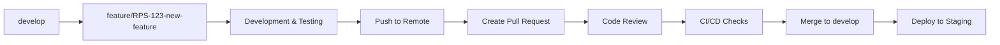
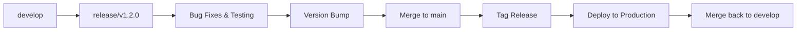
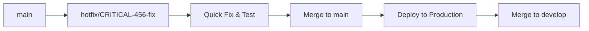

# Git Workflow and Branching Strategy

## Overview
This document defines the Git workflow and branching strategy for the Telegram RPS Tournament Bot project, designed to support continuous integration, collaborative development, and reliable releases.

## Branching Model

### Branch Types and Purpose

#### 1. Main Branch (`main`)
- **Purpose**: Production-ready code
- **Protection**: Branch protection enabled
- **Deployment**: Automatic deployment to production
- **Requirements**: 
  - All checks must pass
  - Minimum 2 reviewer approvals
  - No direct pushes allowed
  - Up-to-date with target branch required

#### 2. Development Branch (`develop`)
- **Purpose**: Integration branch for features
- **Protection**: Branch protection enabled
- **Deployment**: Automatic deployment to staging
- **Requirements**:
  - All checks must pass
  - Minimum 1 reviewer approval
  - No direct pushes allowed

#### 3. Feature Branches (`feature/[ticket-id]-[description]`)
- **Purpose**: Individual feature development
- **Format**: `feature/RPS-123-tournament-bracket-logic`
- **Lifetime**: Created from `develop`, merged back to `develop`
- **Requirements**: All automated tests must pass

#### 4. Release Branches (`release/v[version]`)
- **Purpose**: Release preparation and bug fixes
- **Format**: `release/v1.2.0`
- **Lifetime**: Created from `develop`, merged to both `main` and `develop`
- **Requirements**: Full regression testing required

#### 5. Hotfix Branches (`hotfix/[issue-id]-[description]`)
- **Purpose**: Critical production fixes
- **Format**: `hotfix/CRITICAL-456-tournament-crash-fix`
- **Lifetime**: Created from `main`, merged to both `main` and `develop`
- **Requirements**: Emergency deployment process

#### 6. Bugfix Branches (`bugfix/[issue-id]-[description]`)
- **Purpose**: Non-critical bug fixes
- **Format**: `bugfix/BUG-789-leaderboard-sorting`
- **Lifetime**: Created from `develop`, merged back to `develop`

## Workflow Process

### 1. Feature Development Workflow



#### Step-by-Step Process:
1. **Create Feature Branch**
   ```bash
   git checkout develop
   git pull origin develop
   git checkout -b feature/RPS-123-tournament-bracket-logic
   ```

2. **Development**
   - Write code following project standards
   - Write comprehensive tests (unit, integration)
   - Commit frequently with meaningful messages
   - Follow conventional commits format

3. **Pre-Push Checklist**
   - [ ] All tests pass locally (`npm run test:all`)
   - [ ] Code coverage meets threshold (85%+)
   - [ ] Linting passes (`npm run lint`)
   - [ ] TypeScript compilation successful (`npm run typecheck`)
   - [ ] Manual testing completed

4. **Push and Create PR**
   ```bash
   git push origin feature/RPS-123-tournament-bracket-logic
   # Create PR via GitHub UI or gh CLI
   gh pr create --title "RPS-123: Implement tournament bracket logic" --body-file pr-template.md
   ```

### 2. Release Workflow



#### Release Process:
1. **Create Release Branch**
   ```bash
   git checkout develop
   git pull origin develop
   git checkout -b release/v1.2.0
   ```

2. **Release Preparation**
   - Update version in `package.json`
   - Update CHANGELOG.md
   - Final testing and bug fixes
   - Security scanning and validation

3. **Merge to Main**
   ```bash
   git checkout main
   git merge release/v1.2.0
   git tag -a v1.2.0 -m "Release version 1.2.0"
   git push origin main --tags
   ```

4. **Merge back to Develop**
   ```bash
   git checkout develop
   git merge release/v1.2.0
   git push origin develop
   ```

### 3. Hotfix Workflow



## Commit Message Standards

### Conventional Commits Format
```
<type>[optional scope]: <description>

[optional body]

[optional footer(s)]
```

### Types:
- `feat`: New feature
- `fix`: Bug fix
- `docs`: Documentation changes
- `style`: Code style changes (formatting, etc.)
- `refactor`: Code refactoring
- `perf`: Performance improvements
- `test`: Adding or updating tests
- `chore`: Maintenance tasks
- `ci`: CI/CD changes
- `build`: Build system changes

### Examples:
```
feat(tournament): implement bracket generation algorithm

Add support for single and double elimination tournaments
with automatic seeding based on player ratings.

Closes #RPS-123

fix(bot): resolve message handling timeout issue

Increase timeout duration and add retry logic for
Telegram API calls during high load periods.

Fixes #BUG-456
```

## Pull Request Guidelines

### PR Title Format
```
[TYPE] Brief description (#issue-number)
```

### PR Description Template
```markdown
## Description
Brief summary of changes and motivation.

## Type of Change
- [ ] Bug fix (non-breaking change which fixes an issue)
- [ ] New feature (non-breaking change which adds functionality)
- [ ] Breaking change (fix or feature that would cause existing functionality to not work as expected)
- [ ] Documentation update

## Testing
- [ ] Unit tests pass
- [ ] Integration tests pass
- [ ] E2E tests pass
- [ ] Manual testing completed

## Checklist
- [ ] Code follows project style guidelines
- [ ] Self-review completed
- [ ] Code commented (particularly hard-to-understand areas)
- [ ] Documentation updated
- [ ] No new warnings introduced
- [ ] Tests added/updated for changes

## Related Issues
Closes #issue-number
```

### Review Requirements

#### For Feature Branches → Develop:
- [ ] Minimum 1 reviewer approval
- [ ] All automated checks pass
- [ ] No merge conflicts
- [ ] Branch up-to-date with target

#### For Develop → Main (Release):
- [ ] Minimum 2 reviewer approvals
- [ ] All automated checks pass
- [ ] Security scan completed
- [ ] Performance benchmarks met
- [ ] Documentation updated

#### For Hotfixes → Main:
- [ ] Emergency review process
- [ ] Minimum 1 senior developer approval
- [ ] Critical fixes only
- [ ] Fast-track deployment approval

## Branch Protection Rules

### Main Branch Protection:
```yaml
# .github/branch-protection.yml
protection_rules:
  main:
    required_status_checks:
      strict: true
      contexts:
        - "ci/unit-tests"
        - "ci/integration-tests"
        - "ci/e2e-tests"
        - "ci/security-scan"
        - "ci/performance-tests"
    enforce_admins: true
    required_pull_request_reviews:
      required_approving_review_count: 2
      dismiss_stale_reviews: true
      require_code_owner_reviews: true
    restrictions:
      users: []
      teams: ["senior-developers"]
```

### Develop Branch Protection:
```yaml
  develop:
    required_status_checks:
      strict: true
      contexts:
        - "ci/unit-tests"
        - "ci/integration-tests"
        - "ci/lint-and-format"
    required_pull_request_reviews:
      required_approving_review_count: 1
      dismiss_stale_reviews: true
```

## Git Hooks

### Pre-commit Hook
```bash
#!/bin/bash
# .git/hooks/pre-commit

echo "Running pre-commit checks..."

# Run linting
npm run lint
if [ $? -ne 0 ]; then
    echo "❌ Linting failed. Please fix errors before committing."
    exit 1
fi

# Run type checking
npm run typecheck
if [ $? -ne 0 ]; then
    echo "❌ TypeScript compilation failed."
    exit 1
fi

# Run unit tests
npm run test:unit
if [ $? -ne 0 ]; then
    echo "❌ Unit tests failed."
    exit 1
fi

echo "✅ All pre-commit checks passed!"
```

### Pre-push Hook
```bash
#!/bin/bash
# .git/hooks/pre-push

echo "Running pre-push checks..."

# Run full test suite
npm run test:all
if [ $? -ne 0 ]; then
    echo "❌ Test suite failed."
    exit 1
fi

# Check for secrets
npm run security:check-secrets
if [ $? -ne 0 ]; then
    echo "❌ Potential secrets detected."
    exit 1
fi

echo "✅ All pre-push checks passed!"
```

## Conflict Resolution

### Merge Conflict Guidelines:
1. **Fetch Latest Changes**
   ```bash
   git fetch origin
   git rebase origin/develop
   ```

2. **Resolve Conflicts**
   - Use VS Code merge conflict resolution
   - Test thoroughly after resolution
   - Ensure all automated tests pass

3. **Communication**
   - Comment on PR about conflict resolution
   - Tag relevant developers if needed
   - Document any breaking changes

## Maintenance and Cleanup

### Regular Maintenance Tasks:
1. **Weekly Branch Cleanup**
   ```bash
   # Delete merged feature branches
   git branch --merged develop | grep -v "develop\|main" | xargs -n 1 git branch -d
   
   # Prune remote tracking branches
   git remote prune origin
   ```

2. **Monthly Repository Health Check**
   - Review open PRs older than 30 days
   - Archive stale feature branches
   - Update documentation
   - Review and update branch protection rules

3. **Release Preparation**
   - Create release notes
   - Update version numbers
   - Run full security audit
   - Performance benchmarking

## Emergency Procedures

### Production Hotfix Process:
1. **Immediate Response**
   - Create hotfix branch from main
   - Implement minimal fix
   - Fast-track testing

2. **Emergency Deployment**
   - Skip non-critical checks if necessary
   - Deploy with monitoring
   - Immediate rollback plan ready

3. **Post-Incident**
   - Conduct post-mortem
   - Update documentation
   - Implement preventive measures

## Tools and Integrations

### Recommended Tools:
- **Git Client**: Command line + VS Code Git integration
- **Branch Management**: GitHub CLI (`gh`)
- **Conflict Resolution**: VS Code merge editor
- **Commit Validation**: Husky + lint-staged
- **Release Management**: GitHub Releases

### GitHub Settings:
- Branch protection rules enabled
- Required status checks configured
- Merge button restrictions set
- Auto-merge for qualifying PRs
- Branch auto-deletion after merge

This Git workflow ensures code quality, facilitates collaboration, and maintains a stable codebase while supporting rapid development and reliable releases.